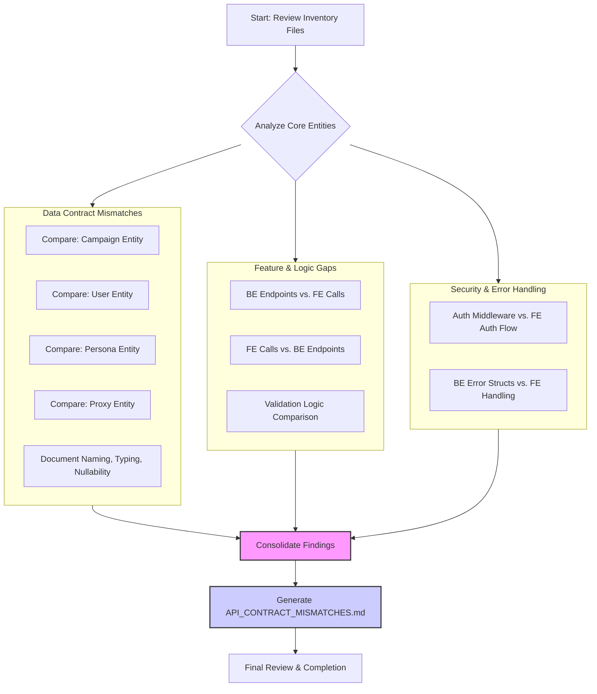

# Plan for API Contract Analysis

This document outlines the structured approach for performing a full-stack API contract audit. The goal is to identify and document all discrepancies between the backend, frontend, and database layers.

## Visual Workflow

## Execution Steps

### Phase 1: Data Contract Deep Dive (Entity by Entity)
1.  **Focus on Core Entities**: Begin with the most complex and central entities to maximize impact. The primary order of analysis will be:
    *   Campaign
    *   User
    *   Persona
    *   Proxy
2.  **Systematic Comparison**: For each entity, meticulously compare its definition across the three layers:
    *   **Backend**: Go structs in `backend/internal/models/` and related service request/response structs.
    *   **Database**: PostgreSQL table schemas in `DATABASE_SCHEMA.md`.
    *   **Frontend**: TypeScript types and Zod schemas in `src/lib/types/` and `src/lib/schemas/`.
3.  **Document Discrepancies**: Catalog every mismatch, paying close attention to:
    *   **Naming Conventions**: e.g., `UserID` (Go) vs. `user_id` (DB) vs. `userId` (TS).
    *   **Data Types**: e.g., `*uuid.UUID` vs. `TEXT` vs. `string | null`.
    *   **Nullability/Optionality**: e.g., a nullable field in Go that is `NOT NULL` in the database.
    *   **Enums**: Ensure enum values are consistent across all layers.

### Phase 2: Gap Analysis (Endpoints & Logic)
1.  **Backend-to-Frontend**: Cross-reference the list of backend API endpoints from `BACKEND_API_INVENTORY.md` with the frontend's service calls in `FRONTEND_API_CONSUMPTION.md`. Identify:
    *   **Unused Endpoints**: Backend routes that are never called by the frontend.
    *   **Unused Fields**: Data fields returned by the backend but ignored by the frontend.
2.  **Frontend-to-Backend**: Identify frontend API calls that target non-existent or undocumented backend endpoints.
3.  **Validation Logic**: Compare validation rules across layers:
    *   Go `validate` tags.
    *   Database `CHECK` constraints.
    *   Frontend Zod schemas.

### Phase 3: Security and Error Handling
1.  **Authentication Flow**: Compare the application of authentication and authorization middleware on backend routes with the documented frontend authentication flows and assumptions.
2.  **Error Handling**: Examine the structure of error responses from the backend (e.g., `api.ErrorResponse`) and compare it against the frontend's error handling logic (e.g., in `ApiErrorBoundary.tsx` or `api/client.ts`).

### Phase 4: Reporting
1.  **Consolidate Findings**: All identified issues will be consolidated into a single report.
2.  **Generate Report**: The final output will be a detailed Markdown file named `API_CONTRACT_MISMATCHES.md`.
3.  **Clear Structure**: The report will be structured with the requested headings ("Data Contract Mismatches," "Feature Gaps," "Security/Error Handling Mismatches") for clarity. Each finding will include specific file and line number references for easy remediation.