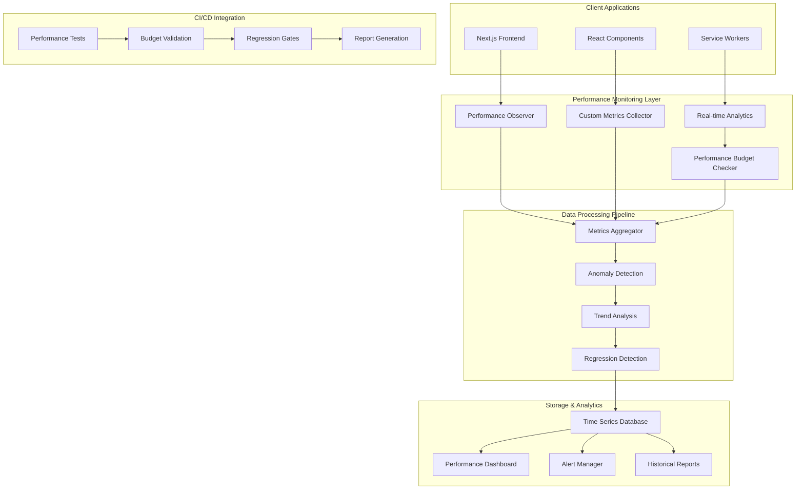

# Performance Monitoring Framework Implementation Plan

## Executive Summary

This document provides a detailed implementation plan for the DomainFlow performance monitoring framework, designed to ensure long-term application health through automated regression detection, continuous monitoring, and proactive alerting systems.

## Table of Contents

1. [Implementation Architecture](#implementation-architecture)
2. [Automated Regression Detection System](#automated-regression-detection-system)
3. [Continuous Performance Monitoring Workflows](#continuous-performance-monitoring-workflows)
4. [Performance Metrics Collection & Alerting](#performance-metrics-collection--alerting)
5. [CI/CD Pipeline Integration](#cicd-pipeline-integration)
6. [Implementation Timeline](#implementation-timeline)
7. [Infrastructure Requirements](#infrastructure-requirements)

---

## Implementation Architecture

### System Overview



### Core Components

1. **Performance Observer**: Real-time metrics collection using browser APIs
2. **Metrics Aggregator**: Centralizes and processes performance data
3. **Anomaly Detection**: Identifies performance deviations using statistical analysis
4. **Alert Manager**: Configurable alerting system for performance issues
5. **Performance Dashboard**: Real-time visualization of performance metrics

---

## Automated Regression Detection System

### Implementation Strategy

#### 1. Baseline Performance Metrics Collection

```typescript
// src/lib/monitoring/performance-baseline.ts
export class PerformanceBaseline {
  private static readonly BASELINE_METRICS_KEY = 'performance_baseline';
  
  static async collectBaseline(): Promise<BaselineMetrics> {
    const metrics = await this.measureAllRoutes();
    const baseline = this.calculateStatisticalBaseline(metrics);
    
    // Store baseline for future comparisons
    await this.storeBaseline(baseline);
    return baseline;
  }
  
  private static async measureAllRoutes(): Promise<RouteMetrics[]> {
    const routes = [
      '/dashboard',
      '/campaigns',
      '/campaigns/new',
      '/personas',
      '/proxies'
    ];
    
    const measurements = await Promise.all(
      routes.map(async (route) => {
        const samples = await this.collectSamples(route, 10);
        return {
          route,
          metrics: this.calculateRouteMetrics(samples)
        };
      })
    );
    
    return measurements;
  }
  
  private static calculateStatisticalBaseline(metrics: RouteMetrics[]): BaselineMetrics {
    return {
      timestamp: Date.now(),
      routes: metrics.map(routeMetric => ({
        route: routeMetric.route,
        fcp: {
          mean: this.calculateMean(routeMetric.metrics.fcp),
          p95: this.calculatePercentile(routeMetric.metrics.fcp, 95),
          stdDev: this.calculateStandardDeviation(routeMetric.metrics.fcp)
        },
        lcp: {
          mean: this.calculateMean(routeMetric.metrics.lcp),
          p95: this.calculatePercentile(routeMetric.metrics.lcp, 95),
          stdDev: this.calculateStandardDeviation(routeMetric.metrics.lcp)
        },
        cls: {
          mean: this.calculateMean(routeMetric.metrics.cls),
          p95: this.calculatePercentile(routeMetric.metrics.cls, 95),
          stdDev: this.calculateStandardDeviation(routeMetric.metrics.cls)
        },
        ttt: {
          mean: this.calculateMean(routeMetric.metrics.ttt),
          p95: this.calculatePercentile(routeMetric.metrics.ttt, 95),
          stdDev: this.calculateStandardDeviation(routeMetric.metrics.ttt)
        }
      }))
    };
  }
}
```

#### 2. Regression Detection Algorithm

```typescript
// src/lib/monitoring/regression-detector.ts
export class RegressionDetector {
  private static readonly REGRESSION_THRESHOLDS = {
    // Statistical significance thresholds
    SIGNIFICANT_CHANGE: 2.0, // 2 standard deviations
    CRITICAL_CHANGE: 3.0,    // 3 standard deviations
    
    // Percentage change thresholds
    WARNING_THRESHOLD: 0.15,  // 15% degradation
    CRITICAL_THRESHOLD: 0.25, // 25% degradation
    
    // Minimum sample size for statistical significance
    MIN_SAMPLE_SIZE: 5
  };
  
  async detectRegressions(
    currentMetrics: PerformanceMetrics,
    baseline: BaselineMetrics
  ): Promise<RegressionReport> {
    const regressions: Regression[] = [];
    
    for (const currentRoute of currentMetrics.routes) {
      const baselineRoute = baseline.routes.find(r => r.route === currentRoute.route);
      if (!baselineRoute) continue;
      
      // Detect FCP regressions
      const fcpRegression = this.detectMetricRegression(
        'FCP',
        currentRoute.fcp,
        baselineRoute.fcp
      );
      if (fcpRegression) regressions.push(fcpRegression);
      
      // Detect LCP regressions
      const lcpRegression = this.detectMetricRegression(
        'LCP',
        currentRoute.lcp,
        baselineRoute.lcp
      );
      if (lcpRegression) regressions.push(lcpRegression);
      
      // Detect CLS regressions
      const clsRegression = this.detectMetricRegression(
        'CLS',
        currentRoute.cls,
        baselineRoute.cls
      );
      if (clsRegression) regressions.push(clsRegression);
    }
    
    return {
      timestamp: Date.now(),
      hasRegressions: regressions.length > 0,
      regressions,
      severity: this.calculateOverallSeverity(regressions),
      recommendations: this.generateRecommendations(regressions)
    };
  }
  
  private detectMetricRegression(
    metricName: string,
    current: MetricSample[],
    baseline: BaselineMetric
  ): Regression | null {
    const currentMean = this.calculateMean(current);
    const percentageChange = (currentMean - baseline.mean) / baseline.mean;
    
    // Statistical significance test (Z-test)
    const zScore = (currentMean - baseline.mean) / baseline.stdDev;
    const isStatisticallySignificant = Math.abs(zScore) >= this.REGRESSION_THRESHOLDS.SIGNIFICANT_CHANGE;
    
    // Practical significance test
    const isPracticallySignificant = Math.abs(percentageChange) >= this.REGRESSION_THRESHOLDS.WARNING_THRESHOLD;
    
    if (isStatisticallySignificant && isPracticallySignificant) {
      return {
        metric: metricName,
        current: currentMean,
        baseline: baseline.mean,
        percentageChange,
        zScore,
        severity: this.calculateRegressionSeverity(percentageChange, zScore),
        confidence: this.calculateConfidence(zScore),
        recommendation: this.getMetricRecommendation(metricName, percentageChange)
      };
    }
    
    return null;
  }
  
  private calculateRegressionSeverity(percentageChange: number, zScore: number): RegressionSeverity {
    if (Math.abs(percentageChange) >= this.REGRESSION_THRESHOLDS.CRITICAL_THRESHOLD ||
        Math.abs(zScore) >= this.REGRESSION_THRESHOLDS.CRITICAL_CHANGE) {
      return 'critical';
    } else if (Math.abs(percentageChange) >= this.REGRESSION_THRESHOLDS.WARNING_THRESHOLD ||
               Math.abs(zScore) >= this.REGRESSION_THRESHOLDS.SIGNIFICANT_CHANGE) {
      return 'warning';
    }
    return 'info';
  }
}
```

#### 3. Automated Baseline Updates

```typescript
// src/lib/monitoring/baseline-manager.ts
export class BaselineManager {
  private static readonly UPDATE_STRATEGIES = {
    ROLLING_WINDOW: 'rolling_window',
    MANUAL_APPROVAL: 'manual_approval',
    AUTOMATED_STABLE: 'automated_stable'
  };
  
  async updateBaseline(strategy: string = this.UPDATE_STRATEGIES.ROLLING_WINDOW): Promise<void> {
    switch (strategy) {
      case this.UPDATE_STRATEGIES.ROLLING_WINDOW:
        await this.updateRollingWindowBaseline();
        break;
      case this.UPDATE_STRATEGIES.MANUAL_APPROVAL:
        await this.proposeBaselineUpdate();
        break;
      case this.UPDATE_STRATEGIES.AUTOMATED_STABLE:
        await this.updateIfStable();
        break;
    }
  }
  
  private async updateRollingWindowBaseline(): Promise<void> {
    const recentMetrics = await this.getRecentMetrics(30); // Last 30 days
    const stableMetrics = this.filterStableMetrics(recentMetrics);
    
    if (stableMetrics.length >= 20) { // Minimum 20 stable measurements
      const newBaseline = await PerformanceBaseline.calculateStatisticalBaseline(stableMetrics);
      await this.storeBaseline(newBaseline);
      await this.notifyBaselineUpdate(newBaseline);
    }
  }
  
  private filterStableMetrics(metrics: PerformanceMetrics[]): PerformanceMetrics[] {
    // Filter out metrics with anomalies or high variance
    return metrics.filter(metric => {
      const isStable = this.isMetricStable(metric);
      const hasNoAnomalies = !this.hasAnomalies(metric);
      return isStable && hasNoAnomalies;
    });
  }
}
```

---

## Continuous Performance Monitoring Workflows

### Real-time Monitoring Implementation

#### 1. Performance Observer Integration

```typescript
// src/lib/monitoring/performance-observer.ts
export class PerformanceMonitoringService {
  private observer: PerformanceObserver | null = null;
  private metricsBuffer: PerformanceMetric[] = [];
  private readonly BUFFER_SIZE = 100;
  private readonly FLUSH_INTERVAL = 30000; // 30 seconds
  
  initialize(): void {
    if (typeof window === 'undefined' || !('PerformanceObserver' in window)) {
      console.warn('[PerformanceMonitor] PerformanceObserver not supported');
      return;
    }
    
    this.setupCoreWebVitalsObserver();
    this.setupNavigationObserver();
    this.setupResourceObserver();
    this.setupCustomMetricsObserver();
    
    // Start periodic buffer flush
    setInterval(() => this.flushMetrics(), this.FLUSH_INTERVAL);
  }
  
  private setupCoreWebVitalsObserver(): void {
    this.observer = new PerformanceObserver((list) => {
      list.getEntries().forEach((entry) => {
        if (entry.entryType === 'paint') {
          this.recordMetric({
            type: entry.name === 'first-contentful-paint' ? 'FCP' : 'FMP',
            value: entry.startTime,
            timestamp: Date.now(),
            route: window.location.pathname
          });
        }
        
        if (entry.entryType === 'largest-contentful-paint') {
          this.recordMetric({
            type: 'LCP',
            value: entry.startTime,
            timestamp: Date.now(),
            route: window.location.pathname
          });
        }
        
        if (entry.entryType === 'layout-shift' && !entry.hadRecentInput) {
          this.recordMetric({
            type: 'CLS',
            value: entry.value,
            timestamp: Date.now(),
            route: window.location.pathname
          });
        }
      });
    });
    
    this.observer.observe({ entryTypes: ['paint', 'largest-contentful-paint', 'layout-shift'] });
  }
  
  private setupCustomMetricsObserver(): void {
    // Monitor custom application metrics
    this.observeComponentRenderTimes();
    this.observeAPIResponseTimes();
    this.observeMemoryUsage();
    this.observeInteractionLatency();
  }
  
  private observeComponentRenderTimes(): void {
    const originalRender = React.Component.prototype.render;
    React.Component.prototype.render = function() {
      const startTime = performance.now();
      const result = originalRender.call(this);
      const endTime = performance.now();
      
      this.recordMetric({
        type: 'COMPONENT_RENDER',
        value: endTime - startTime,
        timestamp: Date.now(),
        metadata: {
          componentName: this.constructor.name,
          route: window.location.pathname
        }
      });
      
      return result;
    };
  }
  
  private observeMemoryUsage(): void {
    if ('memory' in performance) {
      setInterval(() => {
        const memInfo = (performance as any).memory;
        this.recordMetric({
          type: 'MEMORY_USAGE',
          value: memInfo.usedJSHeapSize,
          timestamp: Date.now(),
          metadata: {
            totalJSHeapSize: memInfo.totalJSHeapSize,
            jsHeapSizeLimit: memInfo.jsHeapSizeLimit
          }
        });
      }, 10000); // Every 10 seconds
    }
  }
  
  private async flushMetrics(): Promise<void> {
    if (this.metricsBuffer.length === 0) return;
    
    const metrics = [...this.metricsBuffer];
    this.metricsBuffer = [];
    
    try {
      await this.sendMetricsToBackend(metrics);
    } catch (error) {
      console.error('[PerformanceMonitor] Failed to flush metrics:', error);
      // Re-add metrics to buffer for retry
      this.metricsBuffer.unshift(...metrics);
    }
  }
  
  private recordMetric(metric: PerformanceMetric): void {
    this.metricsBuffer.push(metric);
    
    // Flush immediately if buffer is full
    if (this.metricsBuffer.length >= this.BUFFER_SIZE) {
      this.flushMetrics();
    }
    
    // Check for immediate alerts
    this.checkImmediate Alerts(metric);
  }
}
```

#### 2. Workflow Automation

```typescript
// src/lib/monitoring/workflow-automation.ts
export class PerformanceWorkflowAutomation {
  private readonly workflows: Map<string, WorkflowDefinition> = new Map();
  
  constructor() {
    this.initializeWorkflows();
  }
  
  private initializeWorkflows(): void {
    // Daily performance health check
    this.workflows.set('daily-health-check', {
      name: 'Daily Performance Health Check',
      schedule: '0 9 * * *', // 9 AM daily
      steps: [
        this.collectDailyMetrics,
        this.analyzePerformanceTrends,
        this.checkPerformanceBudgets,
        this.generateDailyReport,
        this.sendDailyDigest
      ]
    });
    
    // Weekly performance analysis
    this.workflows.set('weekly-analysis', {
      name: 'Weekly Performance Analysis',
      schedule: '0 10 * * 1', // 10 AM Monday
      steps: [
        this.collectWeeklyMetrics,
        this.performRegressionAnalysis,
        this.identifyPerformanceOpportunities,
        this.updatePerformanceBaseline,
        this.generateWeeklyReport
      ]
    });
    
    // Real-time alerting workflow
    this.workflows.set('real-time-alerting', {
      name: 'Real-time Performance Alerting',
      trigger: 'metric-threshold-exceeded',
      steps: [
        this.validateAlert,
        this.enrichAlertContext,
        this.determineAlertSeverity,
        this.routeAlert,
        this.trackAlertResolution
      ]
    });
  }
  
  async executeWorkflow(workflowId: string, context?: any): Promise<WorkflowResult> {
    const workflow = this.workflows.get(workflowId);
    if (!workflow) {
      throw new Error(`Workflow ${workflowId} not found`);
    }
    
    const execution: WorkflowExecution = {
      id: generateId(),
      workflowId,
      startTime: Date.now(),
      status: 'running',
      steps: [],
      context: context || {}
    };
    
    try {
      for (const step of workflow.steps) {
        const stepResult = await this.executeStep(step, execution.context);
        execution.steps.push(stepResult);
        
        if (stepResult.status === 'failed' && stepResult.critical) {
          execution.status = 'failed';
          break;
        }
        
        // Merge step context into execution context
        execution.context = { ...execution.context, ...stepResult.context };
      }
      
      if (execution.status === 'running') {
        execution.status = 'completed';
      }
      
      execution.endTime = Date.now();
      execution.duration = execution.endTime - execution.startTime;
      
      return {
        success: execution.status === 'completed',
        execution
      };
    } catch (error) {
      execution.status = 'failed';
      execution.error = error.message;
      execution.endTime = Date.now();
      
      return {
        success: false,
        execution,
        error: error.message
      };
    }
  }
  
  private async collectDailyMetrics(context: any): Promise<StepResult> {
    const endTime = Date.now();
    const startTime = endTime - (24 * 60 * 60 * 1000); // 24 hours ago
    
    const metrics = await this.getMetricsInRange(startTime, endTime);
    const aggregatedMetrics = this.aggregateMetrics(metrics);
    
    return {
      name: 'collectDailyMetrics',
      status: 'completed',
      duration: performance.now() - startTime,
      context: {
        dailyMetrics: aggregatedMetrics,
        sampleCount: metrics.length
      }
    };
  }
  
  private async analyzePerformanceTrends(context: any): Promise<StepResult> {
    const { dailyMetrics } = context;
    const historicalData = await this.getHistoricalMetrics(7); // Last 7 days
    
    const trends = this.calculateTrends(dailyMetrics, historicalData);
    const anomalies = this.detectAnomalies(dailyMetrics, historicalData);
    
    return {
      name: 'analyzePerformanceTrends',
      status: 'completed',
      context: {
        trends,
        anomalies,
        hasRegressions: anomalies.some(a => a.severity === 'high')
      }
    };
  }
}
```

---

## Performance Metrics Collection & Alerting

### Comprehensive Metrics Collection

```typescript
// src/lib/monitoring/metrics-collector.ts
export class MetricsCollector {
  private readonly collectors: Map<string, MetricCollector> = new Map();
  private readonly aggregators: Map<string, MetricAggregator> = new Map();
  
  constructor() {
    this.initializeCollectors();
    this.initializeAggregators();
  }
  
  private initializeCollectors(): void {
    // Core Web Vitals collector
    this.collectors.set('core-web-vitals', new CoreWebVitalsCollector());
    
    // Custom business metrics collector
    this.collectors.set('business-metrics', new BusinessMetricsCollector());
    
    // Infrastructure metrics collector
    this.collectors.set('infrastructure', new InfrastructureMetricsCollector());
    
    // User experience metrics collector
    this.collectors.set('user-experience', new UserExperienceMetricsCollector());
  }
  
  async collectAllMetrics(): Promise<MetricsSnapshot> {
    const snapshot: MetricsSnapshot = {
      timestamp: Date.now(),
      metrics: {},
      metadata: {
        userAgent: navigator.userAgent,
        url: window.location.href,
        referrer: document.referrer,
        connectionType: this.getConnectionType()
      }
    };
    
    // Collect metrics from all collectors
    const collectionPromises = Array.from(this.collectors.entries()).map(
      async ([name, collector]) => {
        try {
          const metrics = await collector.collect();
          snapshot.metrics[name] = metrics;
        } catch (error) {
          console.error(`Failed to collect ${name} metrics:`, error);
          snapshot.metrics[name] = { error: error.message };
        }
      }
    );
    
    await Promise.all(collectionPromises);
    
    return snapshot;
  }
}

// Core Web Vitals specific collector
class CoreWebVitalsCollector implements MetricCollector {
  async collect(): Promise<CoreWebVitalsMetrics> {
    const metrics: CoreWebVitalsMetrics = {
      fcp: await this.measureFCP(),
      lcp: await this.measureLCP(),
      cls: await this.measureCLS(),
      fid: await this.measureFID(),
      ttfb: await this.measureTTFB(),
      inp: await this.measureINP()
    };
    
    return metrics;
  }
  
  private async measureFCP(): Promise<number> {
    return new Promise((resolve) => {
      const observer = new PerformanceObserver((list) => {
        const entries = list.getEntries();
        const fcpEntry = entries.find(entry => entry.name === 'first-contentful-paint');
        if (fcpEntry) {
          resolve(fcpEntry.startTime);
          observer.disconnect();
        }
      });
      observer.observe({ entryTypes: ['paint'] });
      
      // Timeout after 10 seconds
      setTimeout(() => {
        observer.disconnect();
        resolve(-1);
      }, 10000);
    });
  }
  
  private async measureLCP(): Promise<number> {
    return new Promise((resolve) => {
      let lcpValue = 0;
      
      const observer = new PerformanceObserver((list) => {
        const entries = list.getEntries();
        const lastEntry = entries[entries.length - 1];
        lcpValue = lastEntry.startTime;
      });
      
      observer.observe({ entryTypes: ['largest-contentful-paint'] });
      
      // Measure LCP when the page lifecycle changes to hidden
      const onVisibilityChange = () => {
        if (document.visibilityState === 'hidden') {
          observer.disconnect();
          resolve(lcpValue);
          document.removeEventListener('visibilitychange', onVisibilityChange);
        }
      };
      
      document.addEventListener('visibilitychange', onVisibilityChange);
      
      // Timeout after 30 seconds
      setTimeout(() => {
        observer.disconnect();
        document.removeEventListener('visibilitychange', onVisibilityChange);
        resolve(lcpValue || -1);
      }, 30000);
    });
  }
}
```

### Advanced Alerting System

```typescript
// src/lib/monitoring/alerting-system.ts
export class PerformanceAlertingSystem {
  private readonly alertRules: Map<string, AlertRule> = new Map();
  private readonly alertChannels: Map<string, AlertChannel> = new Map();
  private readonly alertHistory: AlertHistory = new AlertHistory();
  
  constructor() {
    this.initializeAlertRules();
    this.initializeAlertChannels();
  }
  
  private initializeAlertRules(): void {
    // Critical performance degradation alerts
    this.alertRules.set('critical-lcp', {
      name: 'Critical LCP Degradation',
      metric: 'lcp',
      condition: 'greater_than',
      threshold: 4000, // 4 seconds
      severity: 'critical',
      evaluationWindow: 300, // 5 minutes
      minimumSamples: 3,
      channels: ['email', 'slack', 'webhook']
    });
    
    this.alertRules.set('memory-leak', {
      name: 'Memory Leak Detection',
      metric: 'memory_usage',
      condition: 'continuous_increase',
      threshold: 50 * 1024 * 1024, // 50MB
      severity: 'warning',
      evaluationWindow: 1800, // 30 minutes
      minimumSamples: 10,
      channels: ['email', 'slack']
    });
    
    this.alertRules.set('high-cls', {
      name: 'High Cumulative Layout Shift',
      metric: 'cls',
      condition: 'greater_than',
      threshold: 0.25,
      severity: 'warning',
      evaluationWindow: 600, // 10 minutes
      minimumSamples: 5,
      channels: ['slack']
    });
    
    // Bundle size alerts
    this.alertRules.set('bundle-size-limit', {
      name: 'Bundle Size Exceeded',
      metric: 'bundle_size',
      condition: 'greater_than',
      threshold: 244 * 1024, // 244KB
      severity: 'critical',
      evaluationWindow: 0, // Immediate
      minimumSamples: 1,
      channels: ['email', 'slack', 'build-failure']
    });
  }
  
  async evaluateAlerts(metrics: MetricsSnapshot): Promise<AlertEvaluation[]> {
    const evaluations: AlertEvaluation[] = [];
    
    for (const [ruleId, rule] of this.alertRules) {
      try {
        const evaluation = await this.evaluateRule(rule, metrics);
        if (evaluation.triggered) {
          evaluations.push(evaluation);
          await this.processTriggeredAlert(ruleId, rule, evaluation);
        }
      } catch (error) {
        console.error(`Failed to evaluate alert rule ${ruleId}:`, error);
      }
    }
    
    return evaluations;
  }
  
  private async evaluateRule(rule: AlertRule, metrics: MetricsSnapshot): Promise<AlertEvaluation> {
    const metricValue = this.extractMetricValue(rule.metric, metrics);
    const historicalData = await this.getHistoricalData(rule.metric, rule.evaluationWindow);
    
    let triggered = false;
    let reason = '';
    
    switch (rule.condition) {
      case 'greater_than':
        triggered = metricValue > rule.threshold;
        reason = `${rule.metric} (${metricValue}) exceeds threshold (${rule.threshold})`;
        break;
        
      case 'less_than':
        triggered = metricValue < rule.threshold;
        reason = `${rule.metric} (${metricValue}) below threshold (${rule.threshold})`;
        break;
        
      case 'continuous_increase':
        triggered = this.detectContinuousIncrease(historicalData, rule.threshold);
        reason = `${rule.metric} showing continuous increase over ${rule.evaluationWindow}s`;
        break;
        
      case 'anomaly':
        triggered = this.detectAnomaly(metricValue, historicalData);
        reason = `${rule.metric} showing anomalous behavior`;
        break;
    }
    
    return {
      ruleId: rule.name,
      triggered,
      reason,
      severity: rule.severity,
      metricValue,
      threshold: rule.threshold,
      timestamp: Date.now()
    };
  }
  
  private async processTriggeredAlert(
    ruleId: string, 
    rule: AlertRule, 
    evaluation: AlertEvaluation
  ): Promise<void> {
    // Check if this alert was recently triggered to avoid spam
    const recentAlert = await this.alertHistory.getRecentAlert(ruleId, 300); // 5 minutes
    if (recentAlert && recentAlert.severity === evaluation.severity) {
      console.log(`Suppressing duplicate alert for ${ruleId}`);
      return;
    }
    
    // Create alert
    const alert: Alert = {
      id: generateId(),
      ruleId,
      rule: rule.name,
      severity: evaluation.severity,
      message: evaluation.reason,
      timestamp: Date.now(),
      metricValue: evaluation.metricValue,
      threshold: evaluation.threshold,
      status: 'active',
      channels: rule.channels
    };
    
    // Store alert in history
    await this.alertHistory.store(alert);
    
    // Send alert through configured channels
    await this.sendAlert(alert);
  }
  
  private async sendAlert(alert: Alert): Promise<void> {
    const sendPromises = alert.channels.map(async (channelName) => {
      const channel = this.alertChannels.get(channelName);
      if (channel) {
        try {
          await channel.send(alert);
        } catch (error) {
          console.error(`Failed to send alert via ${channelName}:`, error);
        }
      }
    });
    
    await Promise.all(sendPromises);
  }
}
```

---

## CI/CD Pipeline Integration

### Performance Gate Implementation

```typescript
// scripts/performance-gate.mjs
export class PerformanceGate {
  constructor(config = {}) {
    this.config = {
      budgets: {
        javascript: 244 * 1024, // 244KB
        css: 50 * 1024,         // 50KB
        images: 500 * 1024,     // 500KB
        total: 1000 * 1024      // 1MB
      },
      coreWebVitals: {
        fcp: 1800,  // 1.8s
        lcp: 2500,  // 2.5s
        cls: 0.1,   // 0.1
        tbt: 200    // 200ms
      },
      regressionThreshold: 0.1, // 10% degradation
      ...config
    };
  }
  
  async validateBuild(buildArtifacts) {
    const results = {
      passed: true,
      violations: [],
      warnings: [],
      metrics: {}
    };
    
    // Check bundle sizes
    const bundleCheck = await this.checkBundleSizes(buildArtifacts);
    results.metrics.bundleSizes = bundleCheck.metrics;
    
    if (!bundleCheck.passed) {
      results.passed = false;
      results.violations.push(...bundleCheck.violations);
    }
    
    // Check Core Web Vitals
    const lighthouseCheck = await this.runLighthouseAudit();
    results.metrics.lighthouse = lighthouseCheck.metrics;
    
    if (!lighthouseCheck.passed) {
      results.passed = false;
      results.violations.push(...lighthouseCheck.violations);
    }
    
    // Check for performance regressions
    const regressionCheck = await this.checkRegressions(results.metrics);
    
    if (!regressionCheck.passed) {
      results.passed = false;
      results.violations.push(...regressionCheck.violations);
    }
    
    return results;
  }
  
  async checkBundleSizes(buildArtifacts) {
    const bundleAnalysis = await this.analyzeBundles(buildArtifacts);
    const violations = [];
    
    // Check JavaScript bundle size
    if (bundleAnalysis.javascript > this.config.budgets.javascript) {
      violations.push({
        type: 'bundle-size',
        metric: 'javascript',
        actual: bundleAnalysis.javascript,
        limit: this.config.budgets.javascript,
        message: `JavaScript bundle size (${formatBytes(bundleAnalysis.javascript)}) exceeds limit (${formatBytes(this.config.budgets.javascript)})`
      });
    }
    
    // Check CSS bundle size
    if (bundleAnalysis.css > this.config.budgets.css) {
      violations.push({
        type: 'bundle-size',
        metric: 'css',
        actual: bundleAnalysis.css,
        limit: this.config.budgets.css,
        message: `CSS bundle size (${formatBytes(bundleAnalysis.css)}) exceeds limit (${formatBytes(this.config.budgets.css)})`
      });
    }
    
    return {
      passed: violations.length === 0,
      violations,
      metrics: bundleAnalysis
    };
  }
  
  async runLighthouseAudit() {
    const lighthouse = await import('lighthouse');
    const violations = [];
    
    const routes = ['/dashboard', '/campaigns', '/campaigns/new'];
    const auditResults = [];
    
    for (const route of routes) {
      const result = await lighthouse.default(`http://localhost:3000${route}`, {
        onlyCategories: ['performance'],
        settings: {
          formFactor: 'desktop',
          throttling: {
            rttMs: 40,
            throughputKbps: 10240,
            cpuSlowdownMultiplier: 1
          }
        }
      });
      
      const metrics = {
        route,
        fcp: result.lhr.audits['first-contentful-paint'].numericValue,
        lcp: result.lhr.audits['largest-contentful-paint'].numericValue,
        cls: result.lhr.audits['cumulative-layout-shift'].numericValue,
        tbt: result.lhr.audits['total-blocking-time'].numericValue,
        score: result.lhr.categories.performance.score * 100
      };
      
      auditResults.push(metrics);
      
      // Check individual metrics
      if (metrics.fcp > this.config.coreWebVitals.fcp) {
        violations.push({
          type: 'core-web-vital',
          metric: 'fcp',
          route,
          actual: metrics.fcp,
          limit: this.config.coreWebVitals.fcp,
          message: `FCP on ${route} (${metrics.fcp}ms) exceeds limit (${this.config.coreWebVitals.fcp}ms)`
        });
      }
      
      if (metrics.lcp > this.config.coreWebVitals.lcp) {
        violations.push({
          type: 'core-web-vital',
          metric: 'lcp',
          route,
          actual: metrics.lcp,
          limit: this.config.coreWebVitals.lcp,
          message: `LCP on ${route} (${metrics.lcp}ms) exceeds limit (${this.config.coreWebVitals.lcp}ms)`
        });
      }
    }
    
    return {
      passed: violations.length === 0,
      violations,
      metrics: auditResults
    };
  }
}
```

### GitHub Actions Workflow

```yaml
# .github/workflows/performance-monitoring.yml
name: Performance Monitoring & Quality Gate

on:
  push:
    branches: [main, develop]
  pull_request:
    branches: [main]

jobs:
  performance-audit:
    runs-on: ubuntu-latest
    
    steps:
      - name: Checkout code
        uses: actions/checkout@v4
        
      - name: Setup Node.js
        uses: actions/setup-node@v4
        with:
          node-version: '18'
          cache: 'npm'
          
      - name: Install dependencies
        run: npm ci
        
      - name: Build application
        run: npm run build
        
      - name: Start application
        run: |
          npm start &
          npx wait-on http://localhost:3000 --timeout 60000
          
      - name: Run bundle analysis
        run: npm run bundle:analyze
        
      - name: Run performance audit
        run: npm run perf:audit
        
      - name: Check performance budgets
        run: npm run perf:budget
        
      - name: Run performance gate
        run: node scripts/performance-gate.mjs
        
      - name: Generate performance report
        run: node scripts/generate-performance-report.mjs
        
      - name: Upload performance artifacts
        uses: actions/upload-artifact@v4
        with:
          name: performance-report-${{ github.sha }}
          path: |
            lighthouse-report.json
            bundle-analysis.json
            performance-report.html
            
      - name: Comment PR with performance results
        if: github.event_name == 'pull_request'
        uses: actions/github-script@v7
        with:
          script: |
            const fs = require('fs');
            const report = JSON.parse(fs.readFileSync('performance-report.json', 'utf8'));
            
            const comment = `
            ## Performance Report 🚀
            
            ### Bundle Sizes
            - JavaScript: ${report.bundleSizes.javascript}
            - CSS: ${report.bundleSizes.css}
            - Total: ${report.bundleSizes.total}
            
            ### Core Web Vitals
            - First Contentful Paint: ${report.coreWebVitals.fcp}ms
            - Largest Contentful Paint: ${report.coreWebVitals.lcp}ms
            - Cumulative Layout Shift: ${report.coreWebVitals.cls}
            
            ### Performance Score: ${report.lighthouseScore}/100
            
            ${report.passed ? '✅ All performance checks passed!' : '❌ Performance checks failed'}
            
            [View detailed report](${report.reportUrl})
            `;
            
            github.rest.issues.createComment({
              issue_number: context.issue.number,
              owner: context.repo.owner,
              repo: context.repo.repo,
              body: comment
            });
```

---

## Implementation Timeline

### Phase 1: Foundation (Weeks 1-2)
- [ ] Implement basic performance monitoring service
- [ ] Set up metrics collection infrastructure
- [ ] Create performance baseline collection system
- [ ] Implement basic alerting system
- [ ] Set up CI/CD performance gates

### Phase 2: Advanced Monitoring (Weeks 3-4)
- [ ] Implement regression detection algorithm
- [ ] Set up automated workflow system
- [ ] Create performance dashboard
- [ ] Implement comprehensive alerting rules
- [ ] Set up performance data storage

### Phase 3: Integration & Optimization (Weeks 5-6)
- [ ] Integrate with existing monitoring tools
- [ ] Optimize performance monitoring overhead
- [ ] Implement advanced analytics and reporting
- [ ] Set up performance trend analysis
- [ ] Create performance governance processes

### Phase 4: Deployment & Validation (Weeks 7-8)
- [ ] Deploy to staging environment
- [ ] Validate monitoring accuracy
- [ ] Fine-tune alerting thresholds
- [ ] Train team on monitoring tools
- [ ] Deploy to production environment

---

## Infrastructure Requirements

### Monitoring Infrastructure
- **Time Series Database**: InfluxDB or Prometheus for metrics storage
- **Dashboard Platform**: Grafana for visualization
- **Alerting Service**: AlertManager or PagerDuty integration
- **Log Aggregation**: ELK stack or similar for log analysis
- **Storage**: Minimum 100GB for 1 year of performance data

### CI/CD Integration
- **Build Agents**: Dedicated agents for performance testing
- **Browser Testing**: Chrome/Chromium for Lighthouse audits
- **Artifact Storage**: S3 or similar for performance reports
- **Notification Services**: Slack, email, webhooks for alerts

### Performance Impact
- **Client Monitoring**: < 1% CPU overhead, < 5MB memory usage
- **Network Overhead**: < 1KB per minute for metrics transmission
- **Storage Requirements**: ~10MB per day per user for detailed metrics

This comprehensive implementation plan provides the foundation for maintaining exceptional performance while scaling the DomainFlow application. The automated monitoring and alerting systems ensure that performance regressions are caught early, while the CI/CD integration prevents performance issues from reaching production.