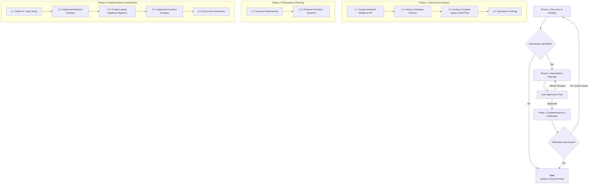

# Workflow Template: Synchronizing Frontend, Backend, and Database

This workflow provides a systematic process for identifying and resolving data inconsistencies across your application stack. It is designed to be executed collaboratively with an AI assistant like Kilo Code, moving from analysis to implementation in a structured manner.

## High-Level Process Flow

This diagram illustrates the overall workflow, which consists of three main phases and a feedback loop for verification and approval.

---

### **Phase 1: Discovery & Analysis**

**Goal:** To create a comprehensive map of data structures and flows across the entire application stack and identify all points of inconsistency.

**Key Activities:**

1.  **Backend Analysis:**
    *   **Action:** Analyze the Go data structures that define your core business logic and database entities.
    *   **Files to inspect:**
        *   Models in `backend/internal/models/` (e.g., `auth_models.go`, `models.go`)
        *   API handlers in `backend/internal/api/` to see how models are serialized and exposed to the frontend (e.g., `auth_handlers.go`).
        *   The API specification, if available, such as `API_SPEC.md`.

2.  **Database Schema Analysis:**
    *   **Action:** Compare the database schema with the backend data models to find discrepancies in table/column names, data types, and constraints.
    *   **Files to inspect:**
        *   The primary database schema file, likely `backend/database/schema.sql` or the most recent consolidated version like `domainflow_consolidated_v2_working.sql`.

3.  **Frontend Analysis:**
    *   **Action:** Trace the data flow from API consumption to UI rendering, aomparing frontend data structures with the backend API contract.
    *   **Files to inspect:**
        *   TypeScript type definitions, primarily `src/lib/types.ts`.
        *   API service files in `src/lib/services/` that consume the backend API (e.g., `authService.ts`).
        *   React components in `src/components/` and `src/app/` that use these types and services.

---

### **Phase 2: Remediation Planning**

**Goal:** To create a clear, actionable plan to resolve the identified mismatches, which you will approve before any code is changed.

**Key Activities:**

1.  **Document Mismatches:**
    *   **Action:** Create a new markdown document (`SYNC_ISSUES.md`) that details each discrepancy found.
    *   **Content for each issue:**
        *   **Location:** e.g., "Frontend Type vs. Backend Model"
        *   **Mismatch:** e.g., "`User.id` is `string` in frontend, but `int` in backend model and `integer` in database."
        *   **Impact:** e.g., "Causes user profile updates to fail."

2.  **Propose & Prioritize Solutions:**
    *   **Action:** For each mismatch, propose a concrete change. A "source of truth" (typically the database or backend) should be established to guide the changes.
    *   **Action:** Rank the fixes based on severity (e.g., critical bug vs. minor inconsistency) to create a prioritized worklist.

3.  **Seek Approval:**
    *   **Action:** Present the complete plan to you for review and feedback. The plan will not be executed until you approve it.

---

### **Phase 3: Implementation & Verification**

**Goal:** To execute the approved remediation plan and confirm that the system is synchronized and functioning correctly.

**Key Activities:**

1.  **Switch to Implementation Mode:**
    *   **Action:** Request to switch from `architect` mode to `code` mode to begin making changes to the files.

2.  **Execute Changes (in logical order):**
    *   **Action 1 (Backend):** Apply changes to Go models and API handlers using precise diffs.
    *   **Action 2 (Database):** If the database schema is affected, create a new SQL migration script. I will provide the script and instructions for you to run it.
    *   **Action 3 (Frontend):** Apply changes to TypeScript types, services, and components to align them with the backend.

3.  **End-to-End Verification:**
    *   **Action:** Run static analysis tools (linters, type checkers) and any existing automated tests.
    *   **Action:** Suggest new tests to cover the areas that were fixed.
    *   **Action:** Provide a checklist for you to manually verify that the fixes work as expected in the running application.