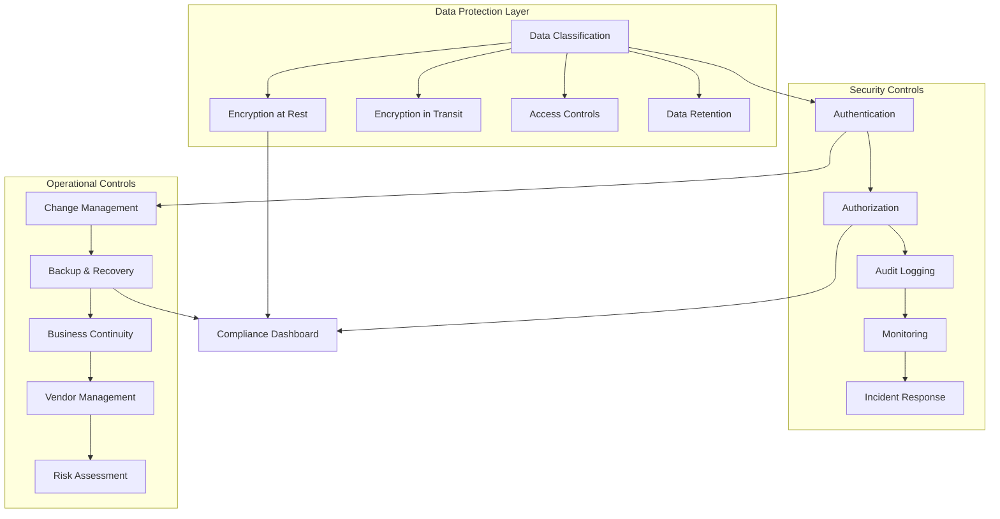

# DomainFlow Compliance Documentation

## Table of Contents

1. [Compliance Overview](#compliance-overview)
2. [GDPR Compliance](#gdpr-compliance)
3. [SOC 2 Compliance](#soc-2-compliance)
4. [ISO 27001 Alignment](#iso-27001-alignment)
5. [OWASP Compliance](#owasp-compliance)
6. [Industry-Specific Compliance](#industry-specific-compliance)
7. [Data Protection & Privacy](#data-protection--privacy)
8. [Audit Trail & Logging](#audit-trail--logging)
9. [Compliance Monitoring](#compliance-monitoring)
10. [Regulatory Reporting](#regulatory-reporting)
11. [Compliance Checklists](#compliance-checklists)
12. [Incident Response & Breach Notification](#incident-response--breach-notification)

## Compliance Overview

DomainFlow is designed with compliance at its core, implementing comprehensive controls and procedures to meet various regulatory requirements and industry standards. Our compliance framework ensures data protection, security, and operational integrity across all system components.

### Supported Compliance Frameworks

- **GDPR** (General Data Protection Regulation)
- **SOC 2 Type II** (Service Organization Control 2)
- **ISO 27001** (Information Security Management)
- **OWASP** (Open Web Application Security Project)
- **NIST Cybersecurity Framework**
- **CCPA** (California Consumer Privacy Act)
- **HIPAA** (Healthcare - when applicable)
- **PCI DSS** (Payment Card Industry - when applicable)

### Compliance Architecture



## GDPR Compliance

### Legal Basis for Processing

DomainFlow processes personal data under the following legal bases:

#### Article 6(1) Legal Bases
- **Consent (6.1.a)**: Marketing communications and optional features
- **Contract (6.1.b)**: Service delivery and account management
- **Legal Obligation (6.1.c)**: Regulatory compliance and legal requirements
- **Legitimate Interest (6.1.f)**: Security monitoring and fraud prevention

#### Special Category Data
- DomainFlow does not process special category data under Article 9
- If special category data is processed, explicit consent is obtained

### Data Subject Rights Implementation

#### Right to Information (Articles 13-14)
```typescript
// Privacy Notice Implementation
interface PrivacyNotice {
  dataController: {
    name: string;
    contact: string;
    dpoContact: string;
  };
  processingPurposes: ProcessingPurpose[];
  legalBasis: LegalBasis[];
  dataRetention: RetentionPolicy;
  dataSubjectRights: DataSubjectRight[];
  dataTransfers: DataTransfer[];
}

const privacyNotice: PrivacyNotice = {
  dataController: {
    name: "DomainFlow Ltd",
    contact: "privacy@domainflow.com",
    dpoContact: "dpo@domainflow.com"
  },
  processingPurposes: [
    {
      purpose: "Service Delivery",
      legalBasis: "Contract",
      dataTypes: ["Account Information", "Usage Data"],
      retention: "Duration of contract + 7 years"
    },
    {
      purpose: "Security Monitoring",
      legalBasis: "Legitimate Interest",
      dataTypes: ["Access Logs", "IP Addresses"],
      retention: "12 months"
    }
  ]
};
```

#### Right of Access (Article 15)
```go
// Data Export Service
type DataExportService struct {
    userRepo     repositories.UserRepository
    auditRepo    repositories.AuditRepository
    campaignRepo repositories.CampaignRepository
}

func (des *DataExportService) ExportUserData(ctx context.Context, userID string) (*UserDataExport, error) {
    export := &UserDataExport{
        ExportDate: time.Now(),
        UserID:     userID,
    }
    
    // Personal data
    user, err := des.userRepo.GetByID(ctx, userID)
    if err != nil {
        return nil, err
    }
    export.PersonalData = &PersonalDataExport{
        Email:     user.Email,
        FirstName: user.FirstName,
        LastName:  user.LastName,
        CreatedAt: user.CreatedAt,
        UpdatedAt: user.UpdatedAt,
    }
    
    // Usage data
    campaigns, err := des.campaignRepo.GetByUserID(ctx, userID)
    if err != nil {
        return nil, err
    }
    export.UsageData = &UsageDataExport{
        Campaigns: campaigns,
        TotalCampaigns: len(campaigns),
    }
    
    // Audit logs
    auditLogs, err := des.auditRepo.GetByUserID(ctx, userID)
    if err != nil {
        return nil, err
    }
    export.AuditLogs = auditLogs
    
    return export, nil
}

type UserDataExport struct {
    ExportDate   time.Time          `json:"exportDate"`
    UserID       string             `json:"userId"`
    PersonalData *PersonalDataExport `json:"personalData"`
    UsageData    *UsageDataExport   `json:"usageData"`
    AuditLogs    []AuditLog         `json:"auditLogs"`
}
```

#### Right to Rectification (Article 16)
```go
// Data Rectification Service
func (us *UserService) UpdatePersonalData(ctx context.Context, userID string, updates PersonalDataUpdate) error {
    // Validate updates
    if err := us.validatePersonalDataUpdate(updates); err != nil {
        return err
    }
    
    // Log the rectification request
    us.auditService.LogEvent(ctx, AuditEvent{
        UserID:    userID,
        EventType: "DATA_RECTIFICATION",
        Details: map[string]interface{}{
            "fields_updated": updates.GetUpdatedFields(),
            "legal_basis":    "Article 16 - Right to Rectification",
        },
    })
    
    // Update the data
    return us.userRepo.UpdatePersonalData(ctx, userID, updates)
}
```

#### Right to Erasure (Article 17)
```go
// Data Erasure Service
type DataErasureService struct {
    userRepo     repositories.UserRepository
    auditRepo    repositories.AuditRepository
    campaignRepo repositories.CampaignRepository
    storageService storage.Service
}

func (des *DataErasureService) EraseUserData(ctx context.Context, userID string, reason ErasureReason) (*ErasureReport, error) {
    report := &ErasureReport{
        UserID:      userID,
        RequestDate: time.Now(),
        Reason:      reason,
        Status:      "IN_PROGRESS",
    }
    
    // Check if erasure is permitted
    if !des.canEraseData(ctx, userID, reason) {
        report.Status = "REJECTED"
        report.RejectionReason = "Legal obligation to retain data"
        return report, nil
    }
    
    // Anonymize audit logs (retain for legal compliance)
    if err := des.auditRepo.AnonymizeUserLogs(ctx, userID); err != nil {
        report.Errors = append(report.Errors, err.Error())
    }
    
    // Delete user campaigns
    if err := des.campaignRepo.DeleteByUserID(ctx, userID); err != nil {
        report.Errors = append(report.Errors, err.Error())
    }
    
    // Delete user files
    if err := des.storageService.DeleteUserFiles(ctx, userID); err != nil {
        report.Errors = append(report.Errors, err.Error())
    }
    
    // Delete user account
    if err := des.userRepo.Delete(ctx, userID); err != nil {
        report.Errors = append(report.Errors, err.Error())
    }
    
    if len(report.Errors) == 0 {
        report.Status = "COMPLETED"
    } else {
        report.Status = "PARTIAL"
    }
    
    return report, nil
}

func (des *DataErasureService) canEraseData(ctx context.Context, userID string, reason ErasureReason) bool {
    // Check legal obligations
    if des.hasLegalObligationToRetain(ctx, userID) {
        return false
    }
    
    // Check if data is necessary for legitimate interests
    if reason == ErasureReasonWithdrawConsent {
        return !des.hasLegitimateInterestToProcess(ctx, userID)
    }
    
    return true
}
```

#### Right to Data Portability (Article 20)
```go
// Data Portability Service
func (dps *DataPortabilityService) ExportPortableData(ctx context.Context, userID string, format string) (*PortableDataExport, error) {
    // Only export data processed based on consent or contract
    portableData := &PortableDataExport{
        UserID:     userID,
        ExportDate: time.Now(),
        Format:     format,
    }
    
    // User-provided data
    user, err := dps.userRepo.GetByID(ctx, userID)
    if err != nil {
        return nil, err
    }
    
    portableData.UserData = map[string]interface{}{
        "email":      user.Email,
        "first_name": user.FirstName,
        "last_name":  user.LastName,
        "preferences": user.Preferences,
    }
    
    // User-generated content
    campaigns, err := dps.campaignRepo.GetUserCreatedCampaigns(ctx, userID)
    if err != nil {
        return nil, err
    }
    
    portableData.UserContent = map[string]interface{}{
        "campaigns": campaigns,
        "personas":  dps.getUserPersonas(ctx, userID),
        "proxies":   dps.getUserProxies(ctx, userID),
    }
    
    // Format the export
    switch format {
    case "json":
        return dps.formatAsJSON(portableData)
    case "csv":
        return dps.formatAsCSV(portableData)
    case "xml":
        return dps.formatAsXML(portableData)
    default:
        return dps.formatAsJSON(portableData)
    }
}
```

### Data Protection by Design and Default

#### Privacy-Preserving Architecture
```go
// Data Minimization Implementation
type DataMinimizationConfig struct {
    CollectionPurpose string
    MinimumDataSet    []string
    RetentionPeriod   time.Duration
    AnonymizationRules []AnonymizationRule
}

func (dm *DataMinimizer) ProcessData(data interface{}, config DataMinimizationConfig) (interface{}, error) {
    // Only collect necessary data
    minimizedData := dm.extractMinimumDataSet(data, config.MinimumDataSet)
    
    // Apply purpose limitation
    if !dm.isDataNecessaryForPurpose(minimizedData, config.CollectionPurpose) {
        return nil, fmt.Errorf("data not necessary for stated purpose")
    }
    
    // Set retention schedule
    dm.scheduleDataDeletion(minimizedData, config.RetentionPeriod)
    
    return minimizedData, nil
}
```

#### Pseudonymization Implementation
```go
// Pseudonymization Service
type PseudonymizationService struct {
    keyManager crypto.KeyManager
}

func (ps *PseudonymizationService) Pseudonymize(data string, context string) (string, error) {
    // Generate context-specific key
    key, err := ps.keyManager.GetKey(context)
    if err != nil {
        return "", err
    }
    
    // Create pseudonym using HMAC
    h := hmac.New(sha256.New, key)
    h.Write([]byte(data))
    pseudonym := hex.EncodeToString(h.Sum(nil))
    
    return pseudonym, nil
}

func (ps *PseudonymizationService) CanReIdentify(pseudonym string, context string) bool {
    // Check if re-identification is possible with available keys
    return ps.keyManager.HasKey(context)
}
```

### Data Transfer Mechanisms

#### Standard Contractual Clauses (SCCs)
```yaml
# Data Transfer Configuration
data_transfers:
  eu_to_us:
    mechanism: "Standard Contractual Clauses"
    scc_version: "2021"
    adequacy_decision: false
    additional_safeguards:
      - "Encryption in transit and at rest"
      - "Access controls and authentication"
      - "Regular security assessments"
      - "Data localization options"
  
  eu_to_uk:
    mechanism: "UK Adequacy Decision"
    adequacy_decision: true
    additional_safeguards: []
```

#### Transfer Impact Assessment (TIA)
```go
// Transfer Impact Assessment
type TransferImpactAssessment struct {
    TransferID          string
    SourceCountry       string
    DestinationCountry  string
    DataCategories      []string
    LegalBasis          string
    SafeguardMeasures   []string
    RiskAssessment      RiskAssessment
    ApprovalStatus      string
    ReviewDate          time.Time
}

func (tia *TIAService) AssessTransfer(transfer DataTransfer) (*TransferImpactAssessment, error) {
    assessment := &TransferImpactAssessment{
        TransferID:         generateTransferID(),
        SourceCountry:      transfer.SourceCountry,
        DestinationCountry: transfer.DestinationCountry,
        DataCategories:     transfer.DataCategories,
    }
    
    // Assess destination country laws
    countryRisk := tia.assessCountryRisk(transfer.DestinationCountry)
    
    // Evaluate safeguard measures
    safeguardEffectiveness := tia.evaluateSafeguards(transfer.SafeguardMeasures)
    
    // Calculate overall risk
    assessment.RiskAssessment = tia.calculateRisk(countryRisk, safeguardEffectiveness)
    
    // Determine approval status
    if assessment.RiskAssessment.OverallRisk <= "MEDIUM" {
        assessment.ApprovalStatus = "APPROVED"
    } else {
        assessment.ApprovalStatus = "REQUIRES_ADDITIONAL_SAFEGUARDS"
    }
    
    return assessment, nil
}
```

## SOC 2 Compliance

### Trust Service Criteria Implementation

#### Security (CC6)
```go
// Security Controls Implementation
type SecurityControls struct {
    AccessControls      AccessControlSystem
    NetworkSecurity     NetworkSecuritySystem
    SystemOperations    OperationsSystem
    ChangeManagement    ChangeManagementSystem
    RiskAssessment      RiskAssessmentSystem
}

// CC6.1 - Logical and Physical Access Controls
func (sc *SecurityControls) ImplementAccessControls() error {
    // Logical access controls
    if err := sc.AccessControls.EnableMultiFactorAuth(); err != nil {
        return err
    }
    
    if err := sc.AccessControls.ImplementRoleBasedAccess(); err != nil {
        return err
    }
    
    if err := sc.AccessControls.EnableSessionManagement(); err != nil {
        return err
    }
    
    // Physical access controls (for on-premises components)
    if err := sc.AccessControls.SecureDataCenters(); err != nil {
        return err
    }
    
    return nil
}

// CC6.2 - System Operations
func (sc *SecurityControls) ManageSystemOperations() error {
    // Capacity monitoring
    if err := sc.SystemOperations.MonitorCapacity(); err != nil {
        return err
    }
    
    // Performance monitoring
    if err := sc.SystemOperations.MonitorPerformance(); err != nil {
        return err
    }
    
    // Incident management
    if err := sc.SystemOperations.ManageIncidents(); err != nil {
        return err
    }
    
    return nil
}
```

#### Availability (CC7)
```go
// Availability Controls
type AvailabilityControls struct {
    MonitoringSystem    MonitoringSystem
    BackupSystem        BackupSystem
    DisasterRecovery    DisasterRecoverySystem
    CapacityManagement  CapacityManagementSystem
}

// CC7.1 - System Availability
func (ac *AvailabilityControls) EnsureAvailability() error {
    // Continuous monitoring
    if err := ac.MonitoringSystem.EnableContinuousMonitoring(); err != nil {
        return err
    }
    
    // Automated alerting
    if err := ac.MonitoringSystem.ConfigureAlerting(); err != nil {
        return err
    }
    
    // Backup procedures
    if err := ac.BackupSystem.ScheduleRegularBackups(); err != nil {
        return err
    }
    
    // Disaster recovery testing
    if err := ac.DisasterRecovery.TestRecoveryProcedures(); err != nil {
        return err
    }
    
    return nil
}
```

#### Processing Integrity (CC8)
```go
// Processing Integrity Controls
type ProcessingIntegrityControls struct {
    DataValidation      ValidationSystem
    ErrorHandling       ErrorHandlingSystem
    ProcessingMonitoring MonitoringSystem
    QualityAssurance    QualityAssuranceSystem
}

// CC8.1 - Data Processing Integrity
func (pic *ProcessingIntegrityControls) EnsureProcessingIntegrity() error {
    // Input validation
    if err := pic.DataValidation.ValidateInputs(); err != nil {
        return err
    }
    
    // Processing controls
    if err := pic.DataValidation.ValidateProcessing(); err != nil {
        return err
    }
    
    // Output validation
    if err := pic.DataValidation.ValidateOutputs(); err != nil {
        return err
    }
    
    // Error handling
    if err := pic.ErrorHandling.HandleProcessingErrors(); err != nil {
        return err
    }
    
    return nil
}
```

### SOC 2 Evidence Collection

#### Automated Evidence Collection
```bash
#!/bin/bash
# SOC 2 Evidence Collection Script

EVIDENCE_DIR="/opt/domainflow/compliance/soc2/evidence"
DATE=$(date +%Y%m%d)

# Create evidence directory
mkdir -p "$EVIDENCE_DIR/$DATE"

# Collect access control evidence
echo "Collecting access control evidence..."
pg_dump -t auth.users -t auth.roles -t auth.user_roles > "$EVIDENCE_DIR/$DATE/access_controls.sql"

# Collect system monitoring evidence
echo "Collecting monitoring evidence..."
journalctl --since="30 days ago" --until="now" > "$EVIDENCE_DIR/$DATE/system_logs.txt"

# Collect backup evidence
echo "Collecting backup evidence..."
ls -la /opt/domainflow/backups/ > "$EVIDENCE_DIR/$DATE/backup_inventory.txt"

# Collect security configuration evidence
echo "Collecting security configuration..."
nginx -T > "$EVIDENCE_DIR/$DATE/nginx_config.txt"
iptables -L > "$EVIDENCE_DIR/$DATE/firewall_rules.txt"

# Collect change management evidence
echo "Collecting change management evidence..."
git log --since="30 days ago" --oneline > "$EVIDENCE_DIR/$DATE/code_changes.txt"

# Generate evidence summary
echo "Generating evidence summary..."
cat > "$EVIDENCE_DIR/$DATE/evidence_summary.txt" << EOF
SOC 2 Evidence Collection Summary
Date: $(date)
Period: $(date -d '30 days ago') to $(date)

Files Collected:
- access_controls.sql: User access and role assignments
- system_logs.txt: System operation logs
- backup_inventory.txt: Backup file inventory
- nginx_config.txt: Web server security configuration
- firewall_rules.txt: Network security rules
- code_changes.txt: Change management records

Collection completed successfully.
EOF

echo "Evidence collection completed: $EVIDENCE_DIR/$DATE"
```

#### Control Testing Procedures
```go
// SOC 2 Control Testing
type ControlTesting struct {
    testResults map[string]TestResult
    testDate    time.Time
}

type TestResult struct {
    ControlID     string
    TestProcedure string
    Result        string
    Evidence      []string
    Exceptions    []string
    Conclusion    string
}

func (ct *ControlTesting) TestAccessControls() TestResult {
    return TestResult{
        ControlID:     "CC6.1",
        TestProcedure: "Test user access provisioning and deprovisioning",
        Result:        "EFFECTIVE",
        Evidence: []string{
            "User access matrix review",
            "Access request approvals",
            "Deprovisioning confirmations",
        },
        Exceptions: []string{},
        Conclusion: "Access controls are operating effectively",
    }
}

func (ct *ControlTesting) TestBackupProcedures() TestResult {
    return TestResult{
        ControlID:     "CC7.2",
        TestProcedure: "Test backup and recovery procedures",
        Result:        "EFFECTIVE",
        Evidence: []string{
            "Backup completion logs",
            "Recovery test results",
            "Backup integrity verification",
        },
        Exceptions: []string{},
        Conclusion: "Backup procedures are operating effectively",
    }
}
```

## ISO 27001 Alignment

### Information Security Management System (ISMS)

#### Risk Management Framework
```go
// ISO 27001 Risk Management
type RiskManagement struct {
    riskRegister    []SecurityRisk
    riskCriteria    RiskCriteria
    treatmentPlans  []RiskTreatmentPlan
}

type SecurityRisk struct {
    ID              string
    Description     string
    Category        string
    Likelihood      int // 1-5 scale
    Impact          int // 1-5 scale
    RiskLevel       string
    Owner           string
    Status          string
    IdentifiedDate  time.Time
    LastReviewed    time.Time
}

type RiskTreatmentPlan struct {
    RiskID          string
    TreatmentOption string // Accept, Avoid, Transfer, Mitigate
    Controls        []SecurityControl
    Implementation  ImplementationPlan
    Monitoring      MonitoringPlan
}

func (rm *RiskManagement) AssessRisk(risk SecurityRisk) SecurityRisk {
    // Calculate risk level
    riskScore := risk.Likelihood * risk.Impact
    
    switch {
    case riskScore >= 20:
        risk.RiskLevel = "CRITICAL"
    case riskScore >= 15:
        risk.RiskLevel = "HIGH"
    case riskScore >= 10:
        risk.RiskLevel = "MEDIUM"
    case riskScore >= 5:
        risk.RiskLevel = "LOW"
    default:
        risk.RiskLevel = "VERY_LOW"
    }
    
    return risk
}
```

#### Security Controls Implementation (Annex A)
```yaml
# ISO 27001 Annex A Controls Implementation
iso27001_controls:
  A.5.1.1: # Information security policies
    implemented: true
    description: "Information security policy established and approved"
    evidence: "docs/policies/information_security_policy.pdf"
    
  A.6.1.1: # Information security roles and responsibilities
    implemented: true
    description: "Security roles and responsibilities defined"
    evidence: "docs/roles/security_roles_matrix.xlsx"
    
  A.8.1.1: # Inventory of assets
    implemented: true
    description: "Asset inventory maintained and updated"
    evidence: "systems/asset_inventory.json"
    
  A.9.1.1: # Access control policy
    implemented: true
    description: "Access control policy established"
    evidence: "docs/policies/access_control_policy.pdf"
    
  A.12.1.1: # Documented operating procedures
    implemented: true
    description: "Operating procedures documented and maintained"
    evidence: "docs/procedures/"
    
  A.14.1.1: # Information security requirements analysis
    implemented: true
    description: "Security requirements included in development"
    evidence: "docs/development/security_requirements.md"
```

### Continuous Improvement Process

#### Management Review Process
```go
// Management Review Implementation
type ManagementReview struct {
    ReviewDate      time.Time
    Participants    []string
    Agenda          []AgendaItem
    Decisions       []ManagementDecision
    ActionItems     []ActionItem
    NextReviewDate  time.Time
}

type AgendaItem struct {
    Topic           string
    Presenter       string
    Duration        time.Duration
    Materials       []string
}

type ManagementDecision struct {
    Topic           string
    Decision        string
    Rationale       string
    Impact          string
    ImplementationDate time.Time
}

func (mr *ManagementReview) ConductReview() error {
    // Review ISMS performance
    performance := mr.reviewISMSPerformance()
    
    // Review risk assessment results
    risks := mr.reviewRiskAssessment()
    
    // Review audit findings
    findings := mr.reviewAuditFindings()
    
    // Review corrective actions
    actions := mr.reviewCorrectiveActions()
    
    // Make decisions for improvement
    decisions := mr.makeImprovementDecisions(performance, risks, findings, actions)
    
    // Document review results
    return mr.documentReview(decisions)
}
```

## OWASP Compliance

### OWASP Top 10 Protection

#### A01: Broken Access Control
```go
// Access Control Implementation
func (ac *AccessController) CheckPermission(userID, resource, action string) error {
    // Get user permissions
    permissions, err := ac.getUserPermissions(userID)
    if err != nil {
        return err
    }
    
    // Check direct permissions
    requiredPermission := fmt.Sprintf("%s.%s", resource, action)
    if ac.hasPermission(permissions, requiredPermission) {
        return nil
    }
    
    // Check resource ownership
    if ac.isResourceOwner(userID, resource) {
        return nil
    }
    
    // Log access denial
    ac.auditLogger.LogAccessDenial(userID, resource, action)
    
    return fmt.Errorf("access denied: insufficient permissions")
}

func (ac *AccessController) hasPermission(permissions []string, required string) bool {
    for _, permission := range permissions {
        if permission == required || permission == "*" {
            return true
        }
    }
    return false
}
```

#### A02: Cryptographic Failures
```go
// Cryptographic Implementation
type CryptoService struct {
    encryptionKey []byte
    signingKey    []byte
}

func (cs *CryptoService) EncryptSensitiveData(data []byte) ([]byte, error) {
    // Use AES-256-GCM for encryption
    block, err := aes.NewCipher(cs.encryptionKey)
    if err != nil {
        return nil, err
    }
    
    gcm, err := cipher.NewGCM(block)
    if err != nil {
        return nil, err
    }
    
    nonce := make([]byte, gcm.NonceSize())
    if _, err := io.ReadFull(rand.Reader, nonce); err != nil {
        return nil, err
    }
    
    ciphertext := gcm.Seal(nonce, nonce, data, nil)
    return ciphertext, nil
}

func (cs *CryptoService) HashPassword(password string) (string, error) {
    // Use bcrypt with appropriate cost
    hash, err := bcrypt.GenerateFromPassword([]byte(password), 12)
    if err != nil {
        return "", err
    }
    return string(hash), nil
}
```

#### A03: Injection
```go
// SQL Injection Prevention
func (r *CampaignRepository) GetCampaignsByUser(userID string) ([]*Campaign, error) {
    // Use parameterized queries
    query := `
        SELECT id, name, description, status, created_at, updated_at 
        FROM campaigns 
        WHERE user_id = $1 AND deleted_at IS NULL
        ORDER BY created_at DESC
    `
    
    rows, err := r.db.Query(query, userID)
    if err != nil {
        return nil, err
    }
    defer rows.Close()
    
    var campaigns []*Campaign
    for rows.Next() {
        campaign := &Campaign{}
        err := rows.Scan(
            &campaign.ID,
            &campaign.Name,
            &campaign.Description,
            &campaign.Status,
            &campaign.CreatedAt,
            &campaign.UpdatedAt,
        )
        if err != nil {
            return nil, err
        }
        campaigns = append(campaigns, campaign)
    }
    
    return campaigns, nil
}

// Input Validation
func (v *InputValidator) ValidateDomain(domain string) error {
    // Validate domain format
    if len(domain) == 0 {
        return errors.New("domain cannot be empty")
    }
    
    if len(domain) > 253 {
        return errors.New("domain too long")
    }
    
    // Use regex for domain validation
    domainRegex := regexp.MustCompile(`^[a-zA-Z0-9]([a-zA-Z0-9\-]{0,61}[a-zA-Z0-9])?(\.[a-zA-Z0-9]([a-zA-Z0-9\-]{0,61}[a-zA-Z0-9])?)*$`)
    if !domainRegex.MatchString(domain) {
        return errors.New("invalid domain format")
    }
    
    return nil
}
```

### OWASP ASVS Implementation

#### Authentication Verification (V2)
```go
// ASVS V2.1 - Password Security Requirements
type PasswordPolicy struct {
    MinLength        int
    MaxLength        int
    RequireUppercase bool
    RequireLowercase bool
    RequireDigits    bool
    RequireSpecial   bool
    PreventReuse     int
    MaxAge           time.Duration
}

func (pp *PasswordPolicy) ValidatePassword(password string, userHistory []string) error {
    // V2.1.1 - Verify password length
    if len(password) < pp.MinLength {
        return fmt.Errorf("password must be at least %d characters", pp.MinLength)
    }
    
    if len(password) > pp.MaxLength {
        return fmt.Errorf("password must be no more than %d characters", pp.MaxLength)
    }
    
    // V2.1.2 - Verify password complexity
    if err := pp.checkComplexity(password); err != nil {
        return err
    }
    
    // V2.1.7 - Verify password is not in breach database
    if pp.is