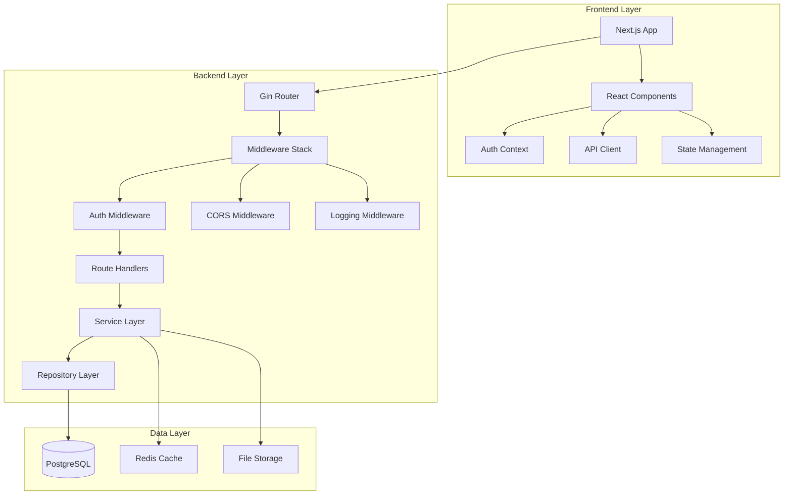

# DomainFlow Developer Guide

## Table of Contents

1. [Development Environment Setup](#development-environment-setup)
2. [Architecture Overview](#architecture-overview)
3. [Authentication System Development](#authentication-system-development)
4. [Backend Development](#backend-development)
5. [Frontend Development](#frontend-development)
6. [Database Development](#database-development)
7. [API Development](#api-development)
8. [Testing Guidelines](#testing-guidelines)
9. [Security Development](#security-development)
10. [Deployment & DevOps](#deployment--devops)
11. [Contributing Guidelines](#contributing-guidelines)
12. [Troubleshooting Development Issues](#troubleshooting-development-issues)

## Development Environment Setup

### Prerequisites

#### Required Software
- **Node.js**: 18.x LTS or higher
- **Go**: 1.21 or higher
- **PostgreSQL**: 14 or higher
- **Docker**: 20.10+ (optional but recommended)
- **Git**: 2.20+

#### Development Tools
- **IDE**: VS Code (recommended) with extensions:
  - Go extension
  - TypeScript and JavaScript
  - PostgreSQL extension
  - Docker extension
  - GitLens
- **Database Client**: pgAdmin, DBeaver, or similar
- **API Testing**: Postman, Insomnia, or curl
- **Version Control**: Git with GitHub/GitLab

### Local Development Setup

#### 1. Clone Repository
```bash
git clone https://github.com/yourusername/domainflow.git
cd domainflow
```

#### 2. Environment Configuration
```bash
# Copy environment template
cp .env.example .env.development

# Edit development configuration
nano .env.development
```

**Development Environment Variables:**
```bash
# Environment
ENV=development
NODE_ENV=development

# Database
DB_HOST=localhost
DB_PORT=5432
DB_NAME=domainflow_dev
DB_USER=domainflow_dev
DB_PASSWORD=dev_password

# API Configuration
API_KEY=dev_api_key_12345
SERVER_PORT=8080
LOG_LEVEL=DEBUG

# Frontend
NEXT_PUBLIC_API_URL=http://localhost:8080
NEXT_PUBLIC_WS_URL=ws://localhost:8080
NEXT_PUBLIC_ENABLE_DEBUG=true

# Security (relaxed for development)
CORS_ORIGINS=http://localhost:3000,http://localhost:8080
ENABLE_SECURE_HEADERS=false
```

#### 3. Database Setup
```bash
# Start PostgreSQL (if not running)
sudo systemctl start postgresql

# Create development database
sudo -u postgres createdb domainflow_dev
sudo -u postgres createuser domainflow_dev

# Set password and permissions
sudo -u postgres psql -c "ALTER USER domainflow_dev PASSWORD 'dev_password';"
sudo -u postgres psql -c "GRANT ALL PRIVILEGES ON DATABASE domainflow_dev TO domainflow_dev;"

# Run migrations
cd backend
go run cmd/migrate/main.go up
```

#### 4. Backend Setup
```bash
cd backend

# Install dependencies
go mod download

# Build the application
go build -o bin/domainflow-apiserver cmd/apiserver/main.go

# Run development server
go run cmd/apiserver/main.go
```

#### 5. Frontend Setup
```bash
cd frontend  # or root directory if frontend is in root

# Install dependencies
npm install

# Start development server
npm run dev
```

#### 6. Verify Installation
```bash
# Check backend health
curl http://localhost:8080/ping

# Check frontend
open http://localhost:3000

# Check database connection
psql -h localhost -U domainflow_dev -d domainflow_dev -c "SELECT version();"
```

### Docker Development Environment

#### Using Docker Compose
```bash
# Start development environment
docker-compose -f docker-compose.dev.yml up -d

# View logs
docker-compose -f docker-compose.dev.yml logs -f

# Stop environment
docker-compose -f docker-compose.dev.yml down
```

#### Development Docker Configuration
```yaml
# docker-compose.dev.yml
version: '3.8'
services:
  postgres:
    image: postgres:14
    environment:
      POSTGRES_DB: domainflow_dev
      POSTGRES_USER: domainflow_dev
      POSTGRES_PASSWORD: dev_password
    ports:
      - "5432:5432"
    volumes:
      - postgres_dev_data:/var/lib/postgresql/data

  backend:
    build:
      context: ./backend
      dockerfile: Dockerfile.dev
    ports:
      - "8080:8080"
    environment:
      - ENV=development
      - DB_HOST=postgres
    volumes:
      - ./backend:/app
    depends_on:
      - postgres

  frontend:
    build:
      context: .
      dockerfile: Dockerfile.dev
    ports:
      - "3000:3000"
    environment:
      - NODE_ENV=development
      - NEXT_PUBLIC_API_URL=http://localhost:8080
    volumes:
      - .:/app
      - /app/node_modules
    depends_on:
      - backend

volumes:
  postgres_dev_data:
```

## Architecture Overview

### System Architecture



### Technology Stack

#### Backend Technologies
- **Language**: Go 1.21+
- **Web Framework**: Gin
- **Database**: PostgreSQL 14+
- **ORM**: GORM v2
- **Authentication**: Custom JWT + Sessions
- **Caching**: Redis (optional)
- **Logging**: Zap
- **Testing**: Testify, Ginkgo

#### Frontend Technologies
- **Framework**: Next.js 15+
- **Language**: TypeScript
- **UI Library**: React 18+
- **Styling**: Tailwind CSS
- **Components**: Radix UI
- **State Management**: React Context + Hooks
- **Forms**: React Hook Form + Zod
- **Testing**: Jest, React Testing Library

#### Development Tools
- **Build Tools**: Go modules, npm/yarn
- **Linting**: golangci-lint, ESLint
- **Formatting**: gofmt, Prettier
- **Type Checking**: TypeScript
- **API Documentation**: Swagger/OpenAPI
- **Database Migrations**: golang-migrate

### Project Structure

```
domainflow/
├── backend/                    # Go backend application
│   ├── cmd/                   # Application entry points
│   │   ├── apiserver/         # Main API server
│   │   ├── migrate/           # Database migration tool
│   │   └── worker/            # Background worker
│   ├── internal/              # Private application code
│   │   ├── auth/              # Authentication system
│   │   ├── handlers/          # HTTP handlers
│   │   ├── middleware/        # HTTP middleware
│   │   ├── models/            # Data models
│   │   ├── repositories/      # Data access layer
│   │   ├── services/          # Business logic
│   │   └── utils/             # Utility functions
│   ├── database/              # Database files
│   │   ├── migrations/        # SQL migration files
│   │   └── schema.sql         # Database schema
│   ├── docs/                  # Backend documentation
│   ├── scripts/               # Build and deployment scripts
│   └── tests/                 # Test files
├── frontend/                  # Next.js frontend (or in root)
│   ├── src/
│   │   ├── app/               # Next.js app directory
│   │   ├── components/        # React components
│   │   ├── contexts/          # React contexts
│   │   ├── hooks/             # Custom hooks
│   │   ├── lib/               # Utility libraries
│   │   └── types/             # TypeScript types
│   ├── public/                # Static assets
│   └── tests/                 # Frontend tests
├── docs/                      # Project documentation
├── scripts/                   # Project scripts
├── docker/                    # Docker configurations
└── .github/                   # GitHub workflows
```

## Authentication System Development

### Authentication Architecture

The DomainFlow authentication system implements a dual approach:

1. **Session-based authentication** for web interface
2. **API key authentication** for programmatic access

#### Core Components

```go
// internal/auth/types.go
type AuthService interface {
    Login(ctx context.Context, req LoginRequest) (*LoginResponse, error)
    Logout(ctx context.Context, sessionID string) error
    ValidateSession(ctx context.Context, sessionID string) (*User, error)
    ValidateAPIKey(ctx context.Context, apiKey string) (*User, error)
    RefreshSession(ctx context.Context, sessionID string) error
}

type User struct {
    ID          string    `json:"id" gorm:"primaryKey"`
    Email       string    `json:"email" gorm:"uniqueIndex"`
    FirstName   string    `json:"firstName"`
    LastName    string    `json:"lastName"`
    PasswordHash string   `json:"-"`
    IsActive    bool      `json:"isActive"`
    Roles       []Role    `json:"roles" gorm:"many2many:user_roles;"`
    CreatedAt   time.Time `json:"createdAt"`
    UpdatedAt   time.Time `json:"updatedAt"`
}

type Session struct {
    ID           string    `json:"id" gorm:"primaryKey"`
    UserID       string    `json:"userId"`
    User         User      `json:"user"`
    IPAddress    string    `json:"ipAddress"`
    UserAgent    string    `json:"userAgent"`
    ExpiresAt    time.Time `json:"expiresAt"`
    LastActivity time.Time `json:"lastActivity"`
    IsActive     bool      `json:"isActive"`
}
```

#### Password Security Implementation

```go
// internal/auth/password.go
package auth

import (
    "crypto/rand"
    "crypto/subtle"
    "encoding/base64"
    "fmt"
    "golang.org/x/crypto/bcrypt"
)

const (
    MinPasswordLength = 12
    MaxPasswordLength = 128
    BcryptCost       = 12
)

type PasswordService struct {
    pepper []byte
}

func NewPasswordService(pepper string) *PasswordService {
    return &PasswordService{
        pepper: []byte(pepper),
    }
}

func (ps *PasswordService) HashPassword(password string) (string, error) {
    if err := ps.validatePassword(password); err != nil {
        return "", err
    }
    
    // Add pepper to password
    pepperedPassword := append([]byte(password), ps.pepper...)
    
    // Generate bcrypt hash
    hash, err := bcrypt.GenerateFromPassword(pepperedPassword, BcryptCost)
    if err != nil {
        return "", fmt.Errorf("failed to hash password: %w", err)
    }
    
    return string(hash), nil
}

func (ps *PasswordService) VerifyPassword(password, hash string) bool {
    pepperedPassword := append([]byte(password), ps.pepper...)
    err := bcrypt.CompareHashAndPassword([]byte(hash), pepperedPassword)
    return err == nil
}

func (ps *PasswordService) validatePassword(password string) error {
    if len(password) < MinPasswordLength {
        return fmt.Errorf("password must be at least %d characters", MinPasswordLength)
    }
    
    if len(password) > MaxPasswordLength {
        return fmt.Errorf("password must be no more than %d characters", MaxPasswordLength)
    }
    
    // Check for required character types
    var hasUpper, hasLower, hasDigit, hasSpecial bool
    
    for _, char := range password {
        switch {
        case char >= 'A' && char <= 'Z':
            hasUpper = true
        case char >= 'a' && char <= 'z':
            hasLower = true
        case char >= '0' && char <= '9':
            hasDigit = true
        case isSpecialChar(char):
            hasSpecial = true
        }
    }
    
    if !hasUpper || !hasLower || !hasDigit || !hasSpecial {
        return fmt.Errorf("password must contain uppercase, lowercase, digit, and special character")
    }
    
    return nil
}

func isSpecialChar(char rune) bool {
    specialChars := "!@#$%^&*()_+-=[]{}|;:,.<>?"
    for _, special := range specialChars {
        if char == special {
            return true
        }
    }
    return false
}
```

#### Session Management

```go
// internal/auth/session.go
package auth

import (
    "context"
    "crypto/rand"
    "encoding/hex"
    "time"
    "gorm.io/gorm"
)

type SessionManager struct {
    db             *gorm.DB
    sessionTimeout time.Duration
    cleanupInterval time.Duration
}

func NewSessionManager(db *gorm.DB) *SessionManager {
    sm := &SessionManager{
        db:              db,
        sessionTimeout:  30 * time.Minute,
        cleanupInterval: 1 * time.Hour,
    }
    
    // Start cleanup goroutine
    go sm.cleanupExpiredSessions()
    
    return sm
}

func (sm *SessionManager) CreateSession(ctx context.Context, userID, ipAddress, userAgent string) (*Session, error) {
    sessionID, err := generateSecureToken(32)
    if err != nil {
        return nil, err
    }
    
    session := &Session{
        ID:           sessionID,
        UserID:       userID,
        IPAddress:    ipAddress,
        UserAgent:    userAgent,
        ExpiresAt:    time.Now().Add(24 * time.Hour),
        LastActivity: time.Now(),
        IsActive:     true,
    }
    
    if err := sm.db.WithContext(ctx).Create(session).Error; err != nil {
        return nil, err
    }
    
    return session, nil
}

func (sm *SessionManager) ValidateSession(ctx context.Context, sessionID string) (*Session, error) {
    var session Session
    err := sm.db.WithContext(ctx).
        Preload("User").
        Where("id = ? AND is_active = ? AND expires_at > ?", sessionID, true, time.Now()).
        First(&session).Error
    
    if err != nil {
        return nil, err
    }
    
    // Check session timeout
    if time.Since(session.LastActivity) > sm.sessionTimeout {
        sm.InvalidateSession(ctx, sessionID)
        return nil, fmt.Errorf("session expired")
    }
    
    // Update last activity
    sm.db.WithContext(ctx).Model(&session).Update("last_activity", time.Now())
    
    return &session, nil
}

func (sm *SessionManager) InvalidateSession(ctx context.Context, sessionID string) error {
    return sm.db.WithContext(ctx).
        Model(&Session{}).
        Where("id = ?", sessionID).
        Update("is_active", false).Error
}

func generateSecureToken(length int) (string, error) {
    bytes := make([]byte, length)
    if _, err := rand.Read(bytes); err != nil {
        return "", err
    }
    return hex.EncodeToString(bytes), nil
}

func (sm *SessionManager) cleanupExpiredSessions() {
    ticker := time.NewTicker(sm.cleanupInterval)
    defer ticker.Stop()
    
    for range ticker.C {
        sm.db.Where("expires_at < ? OR (last_activity < ? AND is_active = ?)",
            time.Now(),
            time.Now().Add(-sm.sessionTimeout),
            true,
        ).Delete(&Session{})
    }
}
```

#### Authentication Middleware

```go
// internal/middleware/auth.go
package middleware

import (
    "net/http"
    "strings"
    "github.com/gin-gonic/gin"
    "your-project/internal/auth"
)

func AuthMiddleware(authService auth.AuthService) gin.HandlerFunc {
    return func(c *gin.Context) {
        // Try API key authentication first
        if apiKey := extractAPIKey(c); apiKey != "" {
            user, err := authService.ValidateAPIKey(c.Request.Context(), apiKey)
            if err == nil {
                c.Set("user", user)
                c.Set("auth_method", "api_key")
                c.Next()
                return
            }
        }
        
        // Try session authentication
        if sessionID := extractSessionID(c); sessionID != "" {
            user, err := authService.ValidateSession(c.Request.Context(), sessionID)
            if err == nil {
                c.Set("user", user)
                c.Set("auth_method", "session")
                c.Next()
                return
            }
        }
        
        // No valid authentication found
        c.JSON(http.StatusUnauthorized, gin.H{
            "error": "Authentication required",
            "code":  "AUTH_REQUIRED",
        })
        c.Abort()
    }
}

func extractAPIKey(c *gin.Context) string {
    auth := c.GetHeader("Authorization")
    if strings.HasPrefix(auth, "Bearer ") {
        return strings.TrimPrefix(auth, "Bearer ")
    }
    return ""
}

func extractSessionID(c *gin.Context) string {
    cookie, err := c.Cookie("domainflow_session")
    if err != nil {
        return ""
    }
    return cookie
}

func RequirePermission(permission string) gin.HandlerFunc {
    return func(c *gin.Context) {
        user, exists := c.Get("user")
        if !exists {
            c.JSON(http.StatusUnauthorized, gin.H{
                "error": "Authentication required",
                "code":  "AUTH_REQUIRED",
            })
            c.Abort()
            return
        }
        
        if !hasPermission(user.(*auth.User), permission) {
            c.JSON(http.StatusForbidden, gin.H{
                "error": "Insufficient permissions",
                "code":  "AUTH_INSUFFICIENT_PERMISSIONS",
                "required": permission,
            })
            c.Abort()
            return
        }
        
        c.Next()
    }
}
```

### Frontend Authentication

#### Auth Context Implementation

```typescript
// src/contexts/AuthContext.tsx
import React, { createContext, useContext, useEffect, useState, ReactNode } from 'react';

interface User {
  id: string;
  email: string;
  firstName: string;
  lastName: string;
  roles: string[];
  permissions: string[];
}

interface AuthContextType {
  user: User | null;
  isAuthenticated: boolean;
  isLoading: boolean;
  login: (credentials: LoginCredentials) => Promise<AuthResult>;
  logout: () => Promise<void>;
  refreshSession: () => Promise<boolean>;
  hasPermission: (permission: string) => boolean;
  hasRole: (role: string) => boolean;
}

interface LoginCredentials {
  email: string;
  password: string;
  rememberMe?: boolean;
}

interface AuthResult {
  success: boolean;
  user?: User;
  error?: string;
}

const AuthContext = createContext<AuthContextType | undefined>(undefined);

export function AuthProvider({ children }: { children: ReactNode }) {
  const [user, setUser] = useState<User | null>(null);
  const [isLoading, setIsLoading] = useState(true);

  const isAuthenticated = !!user;

  useEffect(() => {
    // Check for existing session on mount
    checkSession();
  }, []);

  const checkSession = async () => {
    try {
      const response = await fetch('/api/v2/auth/me', {
        credentials: 'include',
      });

      if (response.ok) {
        const data = await response.json();
        setUser(data.user);
      }
    } catch (error) {
      console.error('Session check failed:', error);
    } finally {
      setIsLoading(false);
    }
  };

  const login = async (credentials: LoginCredentials): Promise<AuthResult> => {
    try {
      const response = await fetch('/api/v2/auth/login', {
        method: 'POST',
        headers: {
          'Content-Type': 'application/json',
        },
        body: JSON.stringify(credentials),
        credentials: 'include',
      });

      const data = await response.json();

      if (response.ok && data.success) {
        setUser(data.user);
        return { success: true, user: data.user };
      } else {
        return { success: false, error: data.error || 'Login failed' };
      }
    } catch (error) {
      return { success: false, error: 'Network error' };
    }
  };

  const logout = async () => {
    try {
      await fetch('/api/v2/auth/logout', {
        method: 'POST',
        credentials: 'include',
      });
    } catch (error) {
      console.error('Logout error:', error);
    } finally {
      setUser(null);
    }
  };

  const refreshSession = async (): Promise<boolean> => {
    try {
      const response = await fetch('/api/v2/auth/refresh', {
        method: 'POST',
        credentials: 'include',
      });

      if (response.ok) {
        const data = await response.json();
        setUser(data.user);
        return true;
      }
    } catch (error) {
      console.error('Session refresh failed:', error);
    }
    return false;
  };

  const hasPermission = (permission: string): boolean => {
    return user?.permissions?.includes(permission) || false;
  };

  const hasRole = (role: string): boolean => {
    return user?.roles?.includes(role) || false;
  };

  const value: AuthContextType = {
    user,
    isAuthenticated,
    isLoading,
    login,
    logout,
    refreshSession,
    hasPermission,
    hasRole,
  };

  return <AuthContext.Provider value={value}>{children}</AuthContext.Provider>;
}

export function useAuth() {
  const context = useContext(AuthContext);
  if (context === undefined) {
    throw new Error('useAuth must be used within an AuthProvider');
  }
  return context;
}
```

#### Protected Route Component

```typescript
// src/components/auth/ProtectedRoute.tsx
import { useAuth } from '@/contexts/AuthContext';
import { useRouter } from 'next/navigation';
import { useEffect } from 'react';

interface ProtectedRouteProps {
  children: React.ReactNode;
  requiredPermission?: string;
  requiredRole?: string;
  fallbackPath?: string;
}

export function ProtectedRoute({
  children,
  requiredPermission,
  requiredRole,
  fallbackPath = '/login'
}: ProtectedRouteProps) {
  const { isAuthenticated, isLoading, hasPermission, hasRole } = useAuth();
  const router = useRouter();

  useEffect(() => {
    if (!isLoading) {
      if (!isAuthenticated) {
        router.push(fallbackPath);
        return;
      }

      if (requiredPermission && !hasPermission(requiredPermission)) {
        router.push('/unauthorized');
        return;
      }

      if (requiredRole && !hasRole(requiredRole)) {
        router.push('/unauthorized');
        return;
      }
    }
  }, [isAuthenticated, isLoading, requiredPermission, requiredRole, router]);

  if (isLoading) {
    return <div>Loading...</div>;
  }

  if (!isAuthenticated) {
    return null;
  }

  if (requiredPermission && !hasPermission(requiredPermission)) {
    return null;
  }

  if (requiredRole && !hasRole(requiredRole)) {
    return null;
  }

  return <>{children}</>;
}
```

## Backend Development

### Project Structure

```
backend/
├── cmd/
│   ├── apiserver/           # Main API server
│   ├── migrate/             # Database migration tool
│   └── worker/              # Background worker
├── internal/
│   ├── auth/                # Authentication system
│   ├── config/              # Configuration management
│   ├── handlers/            # HTTP request handlers
│   ├── middleware/          # HTTP middleware
│   ├── models/              # Data models
│   ├── repositories/        # Data access layer
│   ├── services/            # Business logic
│   └── utils/               # Utility functions
├── database/
│   ├── migrations/          # SQL migration files
│   └── schema.sql           # Complete database schema
└── tests/                   # Test files
```

### Configuration Management

```go
// internal/config/config.go
package config

import (
    "fmt"
    "os"
    "strconv"
    "time"
)

type Config struct {
    Environment string
    Server      ServerConfig
    Database    DatabaseConfig
    Auth        AuthConfig
    Security    SecurityConfig
    Logging     LoggingConfig
}

type ServerConfig struct {
    Port         int
    Host         string
    ReadTimeout  time.Duration
    WriteTimeout time.Duration
    IdleTimeout  time.Duration
}

type DatabaseConfig struct {
    Host            string
    Port            int
    Name            string
    User            string
    Password        string
    SSLMode         string
    MaxOpenConns    int
    MaxIdleConns    int
    ConnMaxLifetime time.Duration
}

type AuthConfig struct {
    JWTSecret       string
    SessionTimeout  time.Duration
    PasswordPepper  string
    BcryptCost      int
}

type SecurityConfig struct {
    CORSOrigins       []string
    EnableSecureHeaders bool
    RateLimitEnabled  bool
}

type LoggingConfig struct {
    Level  string
    Format string
}

func Load() (*Config, error) {
    config := &Config{
        Environment: getEnv("ENV", "development"),
        Server: ServerConfig{
            Port:         getEnvAsInt("SERVER_PORT", 8080),
            Host:         getEnv("SERVER_HOST", "0.0.0.0"),
            ReadTimeout:  getEnvAsDuration("SERVER_READ_TIMEOUT", "30s"),
            WriteTimeout: getEnvAsDuration("SERVER_WRITE_TIMEOUT", "30s"),
            IdleTimeout:  getEnvAsDuration("SERVER_IDLE_TIMEOUT", "120s"),
        },
        Database: DatabaseConfig{
            Host:            getEnv("DB_HOST", "localhost"),
            Port:            getEnvAsInt("DB_PORT", 5432),
            Name:            getEnv("DB_NAME", "domainflow_dev"),
            User:            getEnv("DB_USER", "domainflow_dev"),
            Password:        getEnv("DB_PASSWORD", ""),
            SSLMode:         getEnv("DB_SSLMODE", "disable"),
            MaxOpenConns:    getEnvAsInt("DB_MAX_OPEN_CONNS", 25),
            MaxIdleConns:    getEnvAsInt("DB_MAX_IDLE_CONNS", 10),
            ConnMaxLifetime: getEnvAsDuration("DB_CONN_MAX_LIFETIME", "1h"),
        },
        Auth: AuthConfig{
            JWTSecret:      getEnv("JWT_SECRET", "dev-secret-key"),
            SessionTimeout: getEnvAsDuration("SESSION_TIMEOUT", "30m"),
            PasswordPepper: getEnv("PASSWORD_PEPPER", "dev-pepper"),
            BcryptCost:     getEnvAsInt("BCRYPT_COST", 12),
        },
        Security: SecurityConfig{
            CORSOrigins:       getEnvAsSlice("CORS_ORIGINS", []string{"http://localhost:3000"}),
            EnableSecureHeaders: getEnvAsBool("ENABLE_SECURE_HEADERS", false),
            RateLimitEnabled:  getEnvAsBool("RATE_LIMIT_ENABLED", true),
        },
        Logging: LoggingConfig{
            Level:  getEnv("LOG_LEVEL", "DEBUG"),
            Format: getEnv("LOG_FORMAT", "console"),
        },
    }

    return config, config.validate()
}

func (c *Config) validate() error {
    if c.Database.Password == "" {
        return fmt.Errorf("database password is required")
    }
    
    if c.Auth.JWTSecret == "" {
        return fmt.Errorf("JWT secret is required")
    }
    
    return nil
}

// Helper functions for environment variable parsing
func getEnv(key, defaultValue string) string {
    if value := os.Getenv(key); value != "" {
        return value
    }
    return defaultValue
}

func getEnvAsInt(key string, defaultValue int) int {
    if value := os.Getenv(key); value != "" {
        if intValue, err := strconv.Atoi(value); err == nil {
            return intValue
        }
    }
    return defaultValue
}

func getEnvAsBool(key string, defaultValue bool) bool {
    if value := os.Getenv(key); value != "" {
        if boolValue, err := strconv.ParseBool(value); err == nil {
            return boolValue
        }
    }
    return defaultValue
}

func getEnvAsDuration(key string, defaultValue string) time.Duration {
    if value := os.Getenv(key); value != "" {
        if duration, err := time.ParseDuration(value); err == nil {
            return duration
        }
    }
    duration, _ := time.ParseDuration(defaultValue)
    return duration
}

func getEnvAsSlice(key string, defaultValue []string) []string {
    if value := os.Getenv(key); value != "" {
        return strings.Split(value, ",")
    }
    return defaultValue
}
```

### Service Layer Pattern

```go
// internal/services/campaign_service.go
package services

import (
    "context"
    "fmt"
    "time"
    "your-project/internal/models"
    "your-project/internal/repositories"
)

type CampaignService interface {
    CreateCampaign(ctx context.Context, req CreateCampaignRequest) (*models.Campaign, error)
    GetCampaign(ctx context.Context, id string) (*models.Campaign, error)
    ListCampaigns(ctx context.Context, userID string, filters CampaignFilters) ([]*models.Campaign, error)
    UpdateCampaign(ctx context.Context, id string, req UpdateCampaignRequest) (*models.Campaign, error)
    DeleteCampaign(ctx context.Context, i