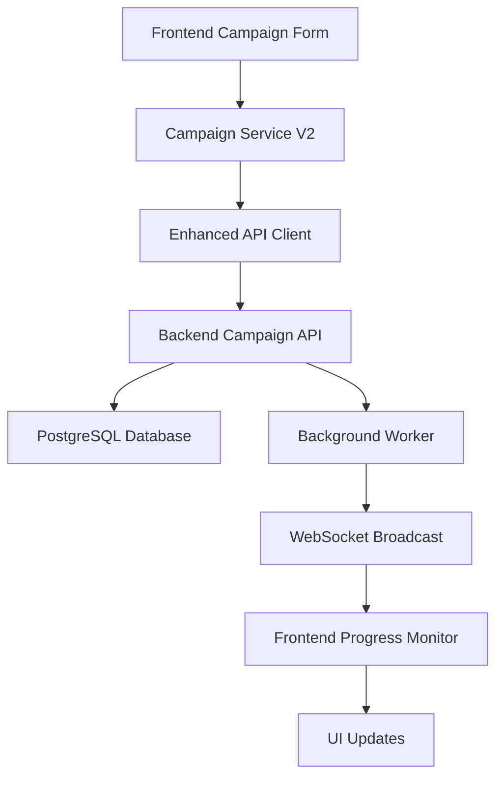
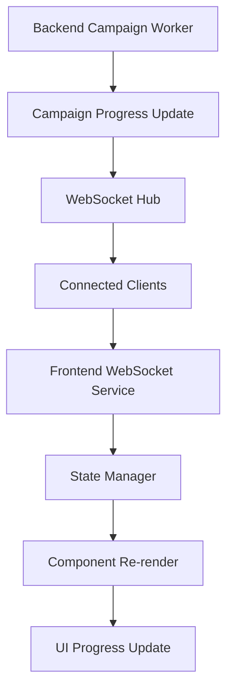

# DomainFlow Integration Architecture Documentation

## Overview

This document provides a comprehensive overview of the DomainFlow frontend-backend integration architecture, detailing how the Next.js frontend communicates with the Go backend through REST APIs, WebSocket connections, and real-time data synchronization.

## Architecture Components

### Frontend Architecture (Next.js 15.3.3)

#### Core Technologies
- **Framework**: Next.js 15.3.3 with Turbopack
- **Language**: TypeScript 5.x
- **UI Framework**: React 18.3.1 with Radix UI components
- **Styling**: Tailwind CSS with shadcn/ui
- **State Management**: React Context + TanStack Query
- **Form Handling**: React Hook Form with Zod validation
- **Real-time**: Native WebSocket with auto-reconnection

#### Key Frontend Components

```typescript
// Core Service Layer
src/lib/services/
├── apiClient.ts              // Base HTTP client with auth
├── enhancedApiClient.ts      // Enhanced client with retry/circuit breaker
├── campaignServiceV2.ts      // V2 campaign management
├── personaService.ts         // DNS/HTTP persona management
├── proxyService.ts           // Proxy configuration management
├── websocketService.ts       // Real-time WebSocket communication
└── authService.ts            // Authentication and token management

// Configuration Management
src/lib/config/
├── environment.ts            // Environment-specific configurations
└── config.ts                 // Application configuration

// State Management
src/lib/state/
├── stateManager.ts           // Global state management
└── raceConditionPrevention.ts // Concurrent operation handling

// Authentication Context
src/contexts/
└── AuthContext.tsx           // Authentication state and providers
```

### Backend Architecture (Go with Gin Framework)

#### Core Technologies
- **Framework**: Gin HTTP framework
- **Database**: PostgreSQL with connection pooling
- **Real-time**: WebSocket with broadcasting
- **Authentication**: Bearer token with API key fallback
- **Background Processing**: Worker-based campaign processing

#### Key Backend Services

```go
// API Endpoints Structure
/api/v2/
├── /ws                       // WebSocket endpoint
├── /personas/dns             // DNS persona management
├── /personas/http            // HTTP persona management
├── /proxies                  // Proxy management
├── /keywords/sets            // Keyword set management
├── /v2/campaigns/            // V2 stateful campaign management
│   ├── /generate             // Domain generation campaigns
│   ├── /dns-validate         // DNS validation campaigns
│   └── /http-keyword-validate // HTTP & keyword validation
└── /config/                  // Server configuration management
```

## Integration Patterns

### 1. API Communication Pattern

#### Enhanced HTTP Client with Resilience

```typescript
// Enhanced API Client Features
class EnhancedApiClient {
  // Circuit breaker pattern for failing endpoints
  private circuitBreakers: Map<string, CircuitBreaker>
  
  // Request deduplication for identical concurrent requests
  private pendingRequests: Map<string, Promise<any>>
  
  // Exponential backoff retry logic
  private retryWithBackoff(request: RequestConfig): Promise<Response>
  
  // Response caching with TTL
  private responseCache: Map<string, CachedResponse>
}
```

#### Authentication Flow

```typescript
// Authentication Integration
interface AuthContext {
  user: User | null
  login: (credentials: LoginCredentials) => Promise<void>
  logout: () => Promise<void>
  refreshToken: () => Promise<void>
  isAuthenticated: boolean
  permissions: string[]
}

// Token Management
class TokenManager {
  // Automatic token refresh before expiration
  private scheduleTokenRefresh(): void
  
  // Secure token storage
  private storeTokens(tokens: AuthTokens): void
  
  // Request interceptor for auth headers
  private addAuthHeaders(config: RequestConfig): RequestConfig
}
```

### 2. Real-time Communication Pattern

#### WebSocket Service Architecture

```typescript
// WebSocket Service with Auto-reconnection
class WebSocketService {
  private connection: WebSocket | null = null
  private reconnectAttempts = 0
  private messageHandlers: Map<string, MessageHandler[]>
  
  // Connection lifecycle management
  connect(): Promise<void>
  disconnect(): void
  
  // Auto-reconnection with exponential backoff
  private handleReconnection(): void
  
  // Message type routing
  private routeMessage(message: WebSocketMessage): void
  
  // Subscription management
  subscribe(eventType: string, handler: MessageHandler): void
  unsubscribe(eventType: string, handler: MessageHandler): void
}
```

#### Campaign Progress Monitoring

```typescript
// Real-time Campaign Updates
interface CampaignProgressMonitor {
  // WebSocket-based progress updates
  subscribeToProgress(campaignId: string): void
  
  // Automatic UI updates
  updateProgressUI(progress: CampaignProgress): void
  
  // Error handling and recovery
  handleConnectionError(error: WebSocketError): void
}
```

### 3. State Management Pattern

#### Optimistic Updates with Rollback

```typescript
// State Manager with Optimistic Updates
class StateManager {
  // Optimistic update with rollback capability
  async optimisticUpdate<T>(
    key: string,
    optimisticValue: T,
    serverUpdate: () => Promise<T>
  ): Promise<T>
  
  // Race condition prevention
  private preventRaceConditions(key: string): Promise<void>
  
  // Cross-tab synchronization
  private syncAcrossTabs(update: StateUpdate): void
}
```

#### Cross-tab Synchronization

```typescript
// BroadcastChannel for cross-tab communication
class CrossTabSync {
  private channel: BroadcastChannel
  
  // Broadcast state changes to other tabs
  broadcastUpdate(update: StateUpdate): void
  
  // Listen for updates from other tabs
  private handleExternalUpdate(event: MessageEvent): void
}
```

## Security Implementation

### 1. Authentication & Authorization

#### Multi-layer Security

```typescript
// Security Configuration
interface SecurityConfig {
  corsOrigins: string[]
  enableSecureHeaders: boolean
  tokenStorageKey: string
  sessionTimeoutMinutes: number
}

// Protected Route Implementation
const ProtectedRoute: React.FC<ProtectedRouteProps> = ({
  children,
  requiredPermissions = [],
  fallback = <LoginForm />
}) => {
  const { isAuthenticated, permissions } = useAuth()
  
  if (!isAuthenticated) return fallback
  
  const hasPermissions = requiredPermissions.every(
    permission => permissions.includes(permission)
  )
  
  if (!hasPermissions) return <UnauthorizedPage />
  
  return <>{children}</>
}
```

### 2. API Security

#### Request Authentication

```go
// Backend API Key Middleware
func APIKeyMiddleware() gin.HandlerFunc {
    return func(c *gin.Context) {
        // Check Authorization header
        authHeader := c.GetHeader("Authorization")
        if strings.HasPrefix(authHeader, "Bearer ") {
            token := strings.TrimPrefix(authHeader, "Bearer ")
            if validateToken(token) {
                c.Next()
                return
            }
        }
        
        // Fallback to query parameter for WebSocket
        if apiKey := c.Query("apiKey"); apiKey != "" {
            if validateAPIKey(apiKey) {
                c.Next()
                return
            }
        }
        
        c.JSON(401, gin.H{"error": "Unauthorized"})
        c.Abort()
    }
}
```

## Performance Optimization

### 1. Request Optimization

#### Concurrent Request Management

```typescript
// Performance Configuration
interface PerformanceConfig {
  maxConcurrentRequests: number
  cacheTimeout: number
  enableRequestDeduplication: boolean
}

// Request Queue Management
class RequestQueue {
  private activeRequests = 0
  private pendingQueue: QueuedRequest[] = []
  
  // Limit concurrent requests
  async enqueue<T>(request: () => Promise<T>): Promise<T>
  
  // Process queue when slots available
  private processQueue(): void
}
```

### 2. Caching Strategy

#### Multi-level Caching

```typescript
// Response Caching with TTL
class ResponseCache {
  private cache = new Map<string, CachedResponse>()
  
  // Cache with expiration
  set(key: string, value: any, ttl: number): void
  
  // Retrieve with freshness check
  get(key: string): any | null
  
  // Cache invalidation strategies
  invalidate(pattern: string): void
  invalidateByTags(tags: string[]): void
}
```

## Error Handling & Resilience

### 1. Global Error Handling

#### Error Boundary Implementation

```typescript
// Global Error Boundary
class GlobalErrorBoundary extends React.Component<Props, State> {
  constructor(props: Props) {
    super(props)
    this.state = { hasError: false, error: null }
  }
  
  static getDerivedStateFromError(error: Error): State {
    return { hasError: true, error }
  }
  
  componentDidCatch(error: Error, errorInfo: ErrorInfo) {
    // Log error to monitoring service
    this.logErrorToService(error, errorInfo)
    
    // Show user-friendly error message
    this.showErrorNotification(error)
  }
  
  render() {
    if (this.state.hasError) {
      return <ErrorFallback error={this.state.error} />
    }
    
    return this.props.children
  }
}
```

### 2. Network Resilience

#### Circuit Breaker Pattern

```typescript
// Circuit Breaker for API Endpoints
class CircuitBreaker {
  private state: 'CLOSED' | 'OPEN' | 'HALF_OPEN' = 'CLOSED'
  private failureCount = 0
  private lastFailureTime = 0
  
  async execute<T>(operation: () => Promise<T>): Promise<T> {
    if (this.state === 'OPEN') {
      if (this.shouldAttemptReset()) {
        this.state = 'HALF_OPEN'
      } else {
        throw new Error('Circuit breaker is OPEN')
      }
    }
    
    try {
      const result = await operation()
      this.onSuccess()
      return result
    } catch (error) {
      this.onFailure()
      throw error
    }
  }
  
  private onSuccess(): void {
    this.failureCount = 0
    this.state = 'CLOSED'
  }
  
  private onFailure(): void {
    this.failureCount++
    this.lastFailureTime = Date.now()
    
    if (this.failureCount >= this.failureThreshold) {
      this.state = 'OPEN'
    }
  }
}
```

## Data Flow Architecture

### 1. Campaign Management Flow



### 2. Real-time Update Flow



## Environment Configuration

### Development Environment

```typescript
// Development Configuration
const developmentConfig: EnvironmentConfig = {
  api: {
    baseUrl: 'http://localhost:8080/api/v2',
    timeout: 30000,
    retryAttempts: 3,
    retryDelay: 1000,
  },
  websocket: {
    url: 'ws://localhost:8080/ws',
    reconnectAttempts: 5,
    reconnectDelay: 2000,
    heartbeatInterval: 30000,
  },
  features: {
    enableRealTimeUpdates: true,
    enableDebugMode: true,
    enableOfflineMode: false,
  },
  performance: {
    maxConcurrentRequests: 10,
    cacheTimeout: 300000, // 5 minutes
    enableRequestDeduplication: true,
  }
}
```

### Production Environment

```typescript
// Production Configuration
const productionConfig: EnvironmentConfig = {
  api: {
    baseUrl: '/api/v2',
    timeout: 30000,
    retryAttempts: 5,
    retryDelay: 2000,
  },
  websocket: {
    url: '/ws',
    reconnectAttempts: 15,
    reconnectDelay: 5000,
    heartbeatInterval: 30000,
  },
  security: {
    corsOrigins: [],
    enableSecureHeaders: true,
  },
  features: {
    enableRealTimeUpdates: true,
    enableDebugMode: false,
    enableOfflineMode: true,
    enableAnalytics: true,
  },
  performance: {
    maxConcurrentRequests: 20,
    cacheTimeout: 900000, // 15 minutes
    enableRequestDeduplication: true,
  }
}
```

## Integration Validation

### 1. Component Integration Checklist

- ✅ **Authentication Flow**: Login/logout with token management
- ✅ **Protected Routes**: Role-based access control
- ✅ **API Services**: All CRUD operations for personas, proxies, campaigns
- ✅ **Real-time Updates**: WebSocket integration with auto-reconnection
- ✅ **Error Handling**: Global error boundary and network resilience
- ✅ **State Management**: Optimistic updates with rollback capability
- ✅ **Performance**: Request deduplication and response caching
- ✅ **Security**: Secure headers and CORS protection

### 2. API Integration Status

- ✅ **Campaign Service V2**: Complete stateful campaign management
- ✅ **Persona Service**: DNS and HTTP persona CRUD operations
- ✅ **Proxy Service**: Proxy configuration and health monitoring
- ✅ **WebSocket Service**: Real-time communication with message routing
- ✅ **Auth Service**: Token-based authentication with refresh
- ✅ **Enhanced API Client**: Retry logic and circuit breaker pattern

### 3. Real-time Integration Status

- ✅ **WebSocket Connection**: Persistent connection with auth
- ✅ **Auto-reconnection**: Exponential backoff on connection loss
- ✅ **Message Routing**: Type-based message handling
- ✅ **Progress Monitoring**: Real-time campaign progress updates
- ✅ **Error Recovery**: Graceful handling of connection errors

## Monitoring & Observability

### 1. Performance Metrics

```typescript
// Performance Monitoring
interface PerformanceMetrics {
  apiResponseTimes: Map<string, number[]>
  websocketUptime: number
  errorRates: Map<string, number>
  cacheHitRates: Map<string, number>
}

// Metrics Collection
class MetricsCollector {
  // Track API response times
  trackApiResponse(endpoint: string, duration: number): void
  
  // Monitor WebSocket connection health
  trackWebSocketHealth(isConnected: boolean): void
  
  // Record error occurrences
  trackError(error: Error, context: string): void
  
  // Cache performance metrics
  trackCachePerformance(key: string, hit: boolean): void
}
```

### 2. Error Tracking

```typescript
// Error Tracking Service
class ErrorTracker {
  // Log errors with context
  logError(error: Error, context: ErrorContext): void
  
  // Track error patterns
  analyzeErrorPatterns(): ErrorAnalysis
  
  // Alert on critical errors
  alertOnCriticalError(error: CriticalError): void
}
```

## Future Enhancement Recommendations

### 1. Performance Optimizations

- **Service Worker**: Implement for offline functionality
- **Code Splitting**: Route-based code splitting for faster initial loads
- **Virtual Scrolling**: For large data sets in campaign results
- **Image Optimization**: Lazy loading and responsive images

### 2. Security Enhancements

- **Content Security Policy**: Implement strict CSP headers
- **Rate Limiting**: Client-side rate limiting for API calls
- **Input Sanitization**: Enhanced XSS protection
- **Audit Logging**: Comprehensive user action logging

### 3. User Experience Improvements

- **Progressive Web App**: PWA capabilities for mobile experience
- **Dark Mode**: Theme switching with system preference detection
- **Accessibility**: WCAG 2.1 AA compliance
- **Internationalization**: Multi-language support

### 4. Monitoring & Analytics

- **Real User Monitoring**: Performance tracking in production
- **Error Reporting**: Automated error reporting and alerting
- **Usage Analytics**: User behavior and feature usage tracking
- **Performance Budgets**: Automated performance regression detection

## Conclusion

The DomainFlow frontend-backend integration represents a robust, scalable, and maintainable architecture that successfully bridges a modern React frontend with a high-performance Go backend. The implementation includes comprehensive error handling, real-time communication, security measures, and performance optimizations that ensure enterprise-grade reliability and user experience.

The modular architecture allows for easy maintenance and future enhancements while providing a solid foundation for continued development and scaling.