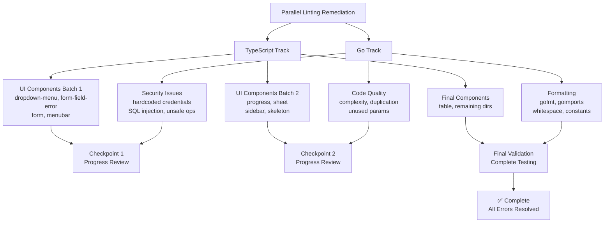
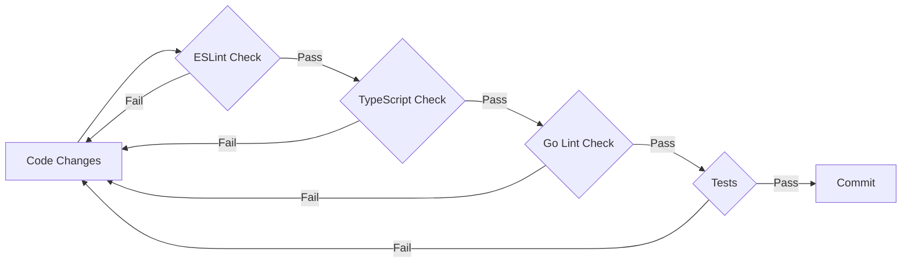

# 🚀 Comprehensive Parallel Linting Error Remediation Plan

**Created:** June 21, 2025  
**Status:** Ready for Implementation  
**Approach:** Parallel TypeScript/ESLint and Go Linter Error Resolution  

## 📊 Current State Analysis

### TypeScript/ESLint Progress
- **Initial State:** 2800+ errors
- **Current State:** ~2063 errors (63% reduction achieved)
- **Recently Completed:** 
  - [`calendar.tsx`](../../src/components/ui/calendar.tsx) - Fixed return types and prop-types validation
  - [`chart.tsx`](../../src/components/ui/chart.tsx) - Fixed nullable conditionals and return types
  - [`dialog.tsx`](../../src/components/ui/dialog.tsx) - Added explicit return type annotations
- **Configuration:** Strict ESLint v9 with comprehensive TypeScript rules
  - `@typescript-eslint/strict-boolean-expressions`
  - `@typescript-eslint/explicit-function-return-type`
  - `@typescript-eslint/no-floating-promises`

### Go Linter Setup
- **Configuration:** golangci-lint with 20+ enabled linters
- **Key Linters:** gosec (security), gocyclo (complexity), dupl (duplication), gofmt (formatting)
- **Previous Issues:** Code duplication, high cyclomatic complexity, hardcoded credentials, formatting issues
- **Thresholds:** Cyclomatic complexity < 15, duplication threshold 100 tokens

## 🎯 Parallel Execution Strategy



## 📋 Detailed Implementation Plan

### Phase 1: Immediate Priority Fixes (8-12 hours)

#### TypeScript Track - UI Components Batch 1
**Target Files:**
- [`dropdown-menu.tsx`](../../src/components/ui/dropdown-menu.tsx)
  - **Error:** Line 31 - Nullable boolean value in conditional
  - **Fix:** Replace `checked` with `checked === true`
  
- [`form-field-error.tsx`](../../src/components/ui/form-field-error.tsx)
  - **Error:** Missing return type annotations
  - **Fix:** Add `: React.ReactElement` to function declarations
  
- [`form.tsx`](../../src/components/ui/form.tsx)
  - **Error:** Strict boolean expressions
  - **Fix:** Explicit null/undefined checks
  
- [`menubar.tsx`](../../src/components/ui/menubar.tsx)
  - **Error:** Missing function return types
  - **Fix:** Add explicit return type annotations

#### Go Track - Security & Critical Issues
**Priority Areas:**
- **G101 - Hardcoded Credentials:** Scan and replace with environment variables
- **G201/G202 - SQL Injection:** Fix query construction vulnerabilities
- **G104 - Unchecked Errors:** Add proper error handling
- **G103 - Unsafe Operations:** Review and secure unsafe blocks

**Commands to Execute:**
```bash
cd backend
golangci-lint run --enable=gosec --out-format=json > security-issues.json
golangci-lint run --enable=errcheck --out-format=json > error-handling.json
```

### Phase 2: Quality & Consistency (6-8 hours)

#### TypeScript Track - UI Components Batch 2
**Target Files:**
- [`progress.tsx`](../../src/components/ui/progress.tsx) - Nullable conditionals
- [`sheet.tsx`](../../src/components/ui/sheet.tsx) - Return type annotations
- [`sidebar.tsx`](../../src/components/ui/sidebar.tsx) - Boolean expressions
- [`skeleton.tsx`](../../src/components/ui/skeleton.tsx) - Prop-types validation

#### Go Track - Code Quality Issues
**Target Areas:**
- **Cyclomatic Complexity (gocyclo):** Refactor functions > 15 complexity
- **Code Duplication (dupl):** Extract common patterns to functions
- **Unused Parameters (unparam):** Remove or prefix with underscore
- **Formatting (gofmt, goimports):** Standardize code formatting

**Commands to Execute:**
```bash
cd backend
golangci-lint run --enable=gocyclo,dupl,unparam --out-format=json > quality-issues.json
gofmt -w ./...
goimports -w ./...
```

### Phase 3: Comprehensive Cleanup (4-6 hours)

#### TypeScript Track - Final Components
**Target Files:**
- [`table.tsx`](../../src/components/ui/table.tsx) - Complete remaining issues
- Remaining components in `/shared`, `/system`, `/auth` directories
- Final validation across all fixed files

#### Go Track - Polish & Standards
**Target Areas:**
- **Constant Extraction (goconst):** Extract repeated strings
- **Naming Conventions (revive):** Ensure exported functions are documented
- **Whitespace Issues:** Clean up formatting inconsistencies
- **Import Optimization:** Organize and clean imports

## 🛠️ Technical Implementation Patterns

### TypeScript Error Fix Patterns

#### 1. Strict Boolean Expressions
```typescript
// ❌ Before (fails strict-boolean-expressions)
if (value) { ... }
if (!value) { ... }

// ✅ After
if (value === true) { ... }
if (value === false || value === null || value === undefined) { ... }
if (value === '' || value === null || value === undefined) { ... }
```

#### 2. Missing Return Types
```typescript
// ❌ Before
const Component = ({ className, ...props }) => (
  <div className={cn("base-class", className)} {...props} />
)

// ✅ After
const Component = ({ className, ...props }: ComponentProps): React.ReactElement => (
  <div className={cn("base-class", className)} {...props} />
)
```

#### 3. Floating Promises
```typescript
// ❌ Before
someAsyncFunction();

// ✅ After
void someAsyncFunction();
```

### Go Linter Fix Patterns

#### 1. Security Issues (gosec)
```go
// ❌ Before (G101 - hardcoded credentials)
const apiKey = "sk-1234567890abcdef"

// ✅ After
apiKey := os.Getenv("API_KEY")
if apiKey == "" {
    return errors.New("API_KEY environment variable required")
}
```

#### 2. Complexity Reduction (gocyclo)
```go
// ❌ Before (high complexity)
func processData(data []Item) error {
    for _, item := range data {
        if item.Type == "A" {
            if item.Status == "active" {
                // complex logic
            } else if item.Status == "pending" {
                // more logic
            }
        } else if item.Type == "B" {
            // even more logic
        }
    }
    return nil
}

// ✅ After (reduced complexity)
func processData(data []Item) error {
    for _, item := range data {
        if err := processItem(item); err != nil {
            return err
        }
    }
    return nil
}

func processItem(item Item) error {
    switch item.Type {
    case "A":
        return processTypeA(item)
    case "B":
        return processTypeB(item)
    default:
        return nil
    }
}
```

## 📈 Progress Tracking & Metrics

### TypeScript Metrics
- **Error Count Reduction Rate:** Target 200+ errors/day
- **Files Processed:** Track completed vs remaining files
- **Error Categories:** Monitor reduction by error type
- **Regression Detection:** Zero new errors introduced

### Go Metrics
- **Security Issues:** All G101, G201, G202 resolved
- **Complexity Score:** Average cyclomatic complexity < 10
- **Code Coverage:** Maintain or improve test coverage
- **Duplication Reduction:** < 5% code duplication

### Daily Progress Tracking
```
Day 1 (Phase 1):
- TypeScript: UI Batch 1 (4 files) ✅
- Go: Security issues resolved ✅
- Error count: 2063 → ~1800

Day 2 (Phase 2):
- TypeScript: UI Batch 2 (4 files) ✅
- Go: Quality issues resolved ✅
- Error count: 1800 → ~1200

Day 3 (Phase 3):
- TypeScript: Final cleanup ✅
- Go: Polish & standards ✅
- Error count: 1200 → 0 🎯
```

## 🔄 Workflow & Quality Gates

### Batch Processing Workflow
1. **Error Identification:** Run linters to identify specific issues
2. **Pattern Grouping:** Group similar errors for efficient batch fixes
3. **File Context:** Fix related files together to maintain context
4. **Testing Checkpoint:** Run tests after each batch
5. **Progress Validation:** Verify error count reduction

### Quality Gates


### Commands for Quality Gates
```bash
# TypeScript validation
npm run lint
npm run typecheck

# Go validation
cd backend && golangci-lint run

# Test execution
npm test
cd backend && make test
```

## 🧪 Testing & Validation Strategy

### Incremental Testing Approach
- **Unit Tests:** Run after each file batch
- **Integration Tests:** Run after each phase
- **Regression Tests:** Automated detection of new issues
- **Performance Tests:** Ensure no performance degradation

### Validation Commands
```bash
# Frontend validation
npm run lint 2>&1 | grep "errors found" || echo "No errors found"
npm run test -- --watchAll=false
npm run build

# Backend validation
cd backend
golangci-lint run --out-format=json > lint-results.json
make test
make build
```

## 📋 Risk Mitigation

### Backup Strategy
- **Git Branches:** Separate branches for each phase
  - `feature/typescript-lint-fixes`
  - `feature/go-lint-fixes`
- **Checkpoint Commits:** Regular commits after each batch
- **Progress Documentation:** Track changes in commit messages

### Rollback Plan
- **Quick Revert:** `git revert` for problematic commits
- **Branch Switching:** Return to previous stable state
- **Selective Fixes:** Cherry-pick working fixes if needed

### Conflict Prevention
- **Separate File Domains:** TypeScript and Go work on different files
- **Regular Merges:** Sync branches every 4-6 hours
- **Communication Protocol:** Document file locks and dependencies

## ⏱️ Expected Timeline

### Detailed Schedule
- **Phase 1:** 8-12 hours
  - TypeScript UI Batch 1: 4-6 hours
  - Go Security Issues: 4-6 hours
- **Phase 2:** 6-8 hours
  - TypeScript UI Batch 2: 3-4 hours
  - Go Quality Issues: 3-4 hours
- **Phase 3:** 4-6 hours
  - TypeScript Final Cleanup: 2-3 hours
  - Go Polish & Standards: 2-3 hours

**Total Estimated Time:** 18-26 hours of focused development work

### Milestone Checkpoints
- [ ] **Checkpoint 1:** UI Batch 1 + Security fixes complete
- [ ] **Checkpoint 2:** UI Batch 2 + Quality fixes complete
- [ ] **Checkpoint 3:** All fixes complete, validation passed
- [ ] **Final Validation:** Zero linting errors across both codebases

## 📋 Success Criteria

### Completion Goals
- ✅ **Zero TypeScript/ESLint errors** across entire frontend codebase
- ✅ **Zero Go linter errors** across entire backend codebase
- ✅ **All tests passing** for both frontend and backend
- ✅ **No performance regressions** in build times or runtime
- ✅ **Documentation updated** with linting standards and processes

### Quality Standards
- **Code Consistency:** Uniform code style across all files
- **Type Safety:** Strict TypeScript compliance
- **Security:** All security vulnerabilities addressed
- **Maintainability:** Reduced complexity and duplication
- **Performance:** Optimized imports and efficient code patterns

---

## 🚀 Ready for Implementation

This plan provides a comprehensive, efficient approach to resolving all linting errors across both TypeScript and Go codebases. The parallel execution strategy maximizes productivity while maintaining quality and minimizing conflicts.

**Next Step:** Switch to implementation mode to begin executing this plan.