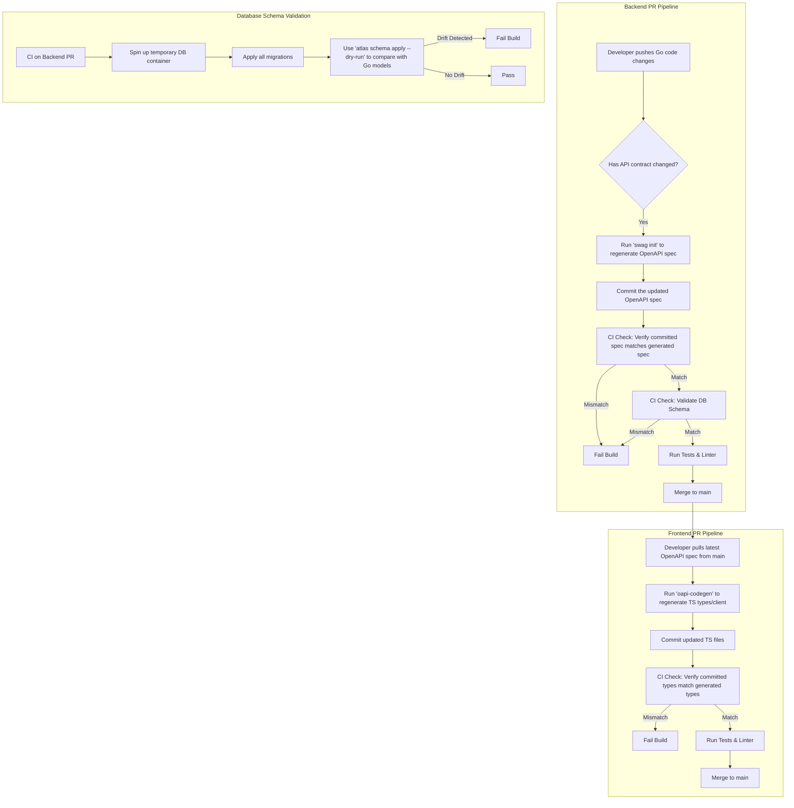

# Proactive Governance Strategy for Cross-Stack Contract Synchronization

## 1. Introduction

This document outlines a proactive governance strategy to prevent contract drift between the Go backend, PostgreSQL database, and TypeScript frontend. The audit findings in the `DISCREPANCY_ANALYSIS_REPORT.md` and `UNIFIED_DATA_CONTRACTS.md` highlight a recurring pattern of inconsistencies that introduce risk, increase maintenance overhead, and slow down development.

The root cause of this drift is the manual and disconnected process of updating contracts across different layers of the stack. To address this, we will adopt a **"Single Source of Truth"** philosophy, where the backend's API definition serves as the canonical contract from which frontend types and even database validation can be derived and verified automatically.

## 2. Core Principles

*   **Backend as the Source of Truth:** The Go code, specifically the API handlers and data models, is the definitive source for all data contracts.
*   **Automation Over Manual Intervention:** Manual updates to client-side types or API documentation are error-prone and will be eliminated. We will automate the generation and validation of contracts.
*   **Fail Fast:** The CI/CD pipeline will be the primary gatekeeper. Builds will fail if any part of the stack is out of sync with the source of truth, preventing drift from ever reaching production.
*   **Clear Development Workflow:** Developers must follow a clear, tool-assisted workflow for making changes to data contracts.

## 3. Proposed Governance Strategy

### 3.1. Tooling

We will introduce a set of tools to automate contract generation and validation.

| Layer | Tool | Purpose |
| :--- | :--- | :--- |
| **Backend (Go)** | [**swaggo/swag**](https://github.com/swaggo/swag) | To generate an OpenAPI 3.0 specification (`API_SPEC.md` or `swagger.json`) directly from annotations in the Go source code. This keeps the documentation in sync with the implementation. |
| **Frontend (TS)** | [**oapi-codegen**](https://github.com/deepmap/oapi-codegen) | To generate TypeScript types and an API client directly from the OpenAPI specification produced by the backend. This eliminates manual type definitions and ensures the frontend is always aligned with the API. |
| **Database** | [**Atlas**](https://atlasgo.io/) | To manage and validate the database schema. Atlas can compare the desired schema (derived from Go structs or a declarative file) against the actual database schema, preventing drift. |

### 3.2. CI/CD Integration

The selected tools will be integrated into the CI/CD pipeline to enforce contract synchronization on every pull request.

**CI Pipeline Steps:**

1.  **Backend Pull Request:**
    *   A step will run `swag init` to generate the OpenAPI spec.
    *   The pipeline will then check if the generated spec has any differences from the `API_SPEC.md` file committed in the repository. If there's a diff, the build fails, forcing the developer to commit the updated spec.
    *   A second step will use `atlas schema apply --dry-run` to compare the expected schema (derived from models) against a temporary database instance with all migrations applied. If there's drift, the build fails.

2.  **Frontend Pull Request:**
    *   A step will fetch the latest `API_SPEC.md` from the backend's main branch.
    *   It will then run `oapi-codegen` to regenerate the TypeScript types and API client.
    *   The pipeline will check for differences between the generated files and the committed files. A mismatch will fail the build, ensuring the frontend is always using the latest contract.

### 3.3. Development Workflow Changes

To make this strategy effective, developers must adapt their workflow.

1.  **Making an API Change (The Backend-First Workflow):**
    *   **Step 1: Modify Go Code:** The developer modifies the Go models or API handlers.
    *   **Step 2: Update Annotations:** The developer updates the `swaggo/swag` annotations to reflect the changes.
    *   **Step 3: Regenerate Contracts:** The developer runs a local script (e.g., `make contracts`) that executes `swag init` to update the `API_SPEC.md` file.
    *   **Step 4: Commit Changes:** The developer commits the Go code changes *and* the updated `API_SPEC.md` file in the same pull request.
    *   **Step 5: Update Frontend:** After the backend PR is merged, the frontend developer pulls the latest `API_SPEC.md`, regenerates the TypeScript client using `oapi-codegen`, and implements the necessary UI changes.

2.  **Database Schema Changes:**
    *   The developer creates a new migration file.
    *   The developer updates the corresponding Go model (if using an ORM that defines schema).
    *   The CI pipeline's Atlas check will automatically verify that the migration results in a schema that matches the models.

## 4. Conclusion

By implementing this governance strategy, we move from a reactive, error-prone manual system to a proactive, automated one. This will significantly reduce cross-stack bugs, improve developer velocity, and ensure that our backend, frontend, and database remain in perfect synchronization as the application evolves.